Every so often I like to take a look at datasets from the TidyTuesday project. If you are unaware, TidyTuesday is a social data project where every week a dataset is collected and posted for analysis by the R community. People will dive in to do simple(or complex) one-off analyses and visualizations and then post them under the #TidyTuesday hashtag to share with the community. It's a great opportunity to learn from others, riff on an idea you've been mulling over, or just to practice on interesting, readily available datasets.

A couple months ago I was analyzing some [Seattle Public Library data](https://ahoulette.com/posts/seattle-library-analysis/) and I wanted to see how wide a swath of books people read. One approach I came up with was, essentially, taking the number of checkouts of every book, ordering them highest to lowest and then calculating a cumulative sum of book checkouts[^1]. With that information I could create the really interesting plot in @fig-one.

[^1]: If you are reading carefully, you're probably saying "isn't that just an empirical cumulative density function plot"? The answer is pretty much yes, but the x-axis is a little different. Stay with me and I'll get into the differences in a moment.

{#fig-one .lightbox}

The left plot shows the number of books it takes to reach a certain(in this instance 75%) percentage of total checkouts and the right plot zooms in and shows the proportion of total checkouts the top 100 books represents. When I wrote that Seattle library post, I thought that the cumulative book share plot was a pretty interesting way of visualizing the relatively common phenomenon where a small handful of books/movies/shows/videos/games/etc make up a huge portion of the total consumption of a medium, but the medium has an extremely long, thin tail after those initial popular items. For the Seattle library, \~25k books may make up 75% of checkouts, but there are \~275k *more* books that make up the remaining 25%.

Enter the TidyTuesday datasets. The July 29th, 2025 TidyTuesday [dataset](https://github.com/rfordatascience/tidytuesday/blob/main/data/2025/2025-07-29/readme.md) was a bundling of the engagement reports that Netflix releases every 6 months. This dataset featured, according to Netflix, 99% of all viewing of movies and shows for each 6 month period from July 2023 - June 2025. When I first found this dataset I was just finishing up my Seattle library post, but I immediately knew I wanted to see what the cumulative share plots would reveal for the Netflix data. So in this post I have two '*simple*' goals:

1)  Visualize the show data through the lens of cumulative viewing plots to see how long the tail of the Netflix show library is.
2)  Explore how the viewing of shows changes across the four engagement reports present in the dataset. This is a relatively open-ended question and will need to be clarified and scoped when I get to it.

So let's dive in and see what the data reveals!

## Data Import and Cleaning

```{r, table_formating_functions, echo = FALSE}
# format the numbers displayed in a table
format_table_numbers <- function(table, scale_vals = FALSE){
    table |>
      fmt_percent(
        columns = everything(),
        decimals = 2,
        scale_values = scale_vals
      ) 
}
# format the header of a table
format_table_header <- function(table) {
  table |>  
    tab_style(
      style = list(
        cell_text(weight = 'bold',
                  transform = 'capitalize'
        )
      ),
      locations = cells_column_labels(everything())
    )
}

# format the styling of a table
format_table_style <- function(table){
  table |> 
    tab_style(
      style = cell_borders(
        sides = c("top", "bottom")),
      locations = cells_body()) |> 
    opt_stylize(add_row_striping = TRUE, color = 'gray')|> 
    tab_options(quarto.disable_processing = TRUE)
}
```

```{r, data-import}
#| message: false
#| warning: false

library(tidyverse)
library(patchwork)
library(gt)
shows <- readr::read_csv('https://raw.githubusercontent.com/rfordatascience/tidytuesday/main/data/2025/2025-07-29/shows.csv')
```

```{r, data-cleaning}
calculate_days_since_release <- function(df){
    # determines the number of days between the release date and the 
    # last day of the reporting period
    df |> 
        group_by(report) |> 
        mutate(
            report_date = case_when(
                report == "2025Jan-Jun" ~ as.Date("2025-06-30"),
                report == "2024Jul-Dec" ~ as.Date("2024-12-31"),
                report == "2024Jan-Jun" ~ as.Date("2024-06-30"),
                report == "2023Jul-Dec" ~ as.Date("2023-12-31")
            ),
            days_since_release = case_when(
                is.na(release_date) ~ NA,
                .default = as.numeric(report_date - release_date)))
}

shows_cleaned <- shows |> 
    calculate_days_since_release() |> 
    ungroup() |> 
    select(report, title, release_date:days_since_release) |> 
    mutate(title = case_when(
        title == 'Stranger Things 4' ~ 'Stranger Things: Season 4',
        title == 'Stranger Things 3' ~ 'Stranger Things: Season 3',
        title == 'Stranger Things 2' ~ 'Stranger Things: Season 2',
        title == 'Stranger Things' ~ 'Stranger Things: Season 1',
        .default = title
    )) |> 
    mutate(title = str_remove_all(title, " \\/\\/.*")) |> 
    mutate(
        series = case_when(
            !grepl(":", title) ~ title, 
            .default = str_split_i(title, ":", 1)), 
        season = case_when(
            !grepl(":", title) ~ NA,
            .default = str_split_i(title, ": ", 2)
        ),
        season_number = case_when(
            str_detect(season, "Season|Part|Collection|Volume|Chapter.*") == TRUE ~ str_extract(season, "[0-9]+"),
            .default = NA
        )) |> 
    group_by(series) |> 
    mutate(total_seasons = as.integer(max(season_number, na.rm = TRUE)),
           report_date = as.factor(report_date)
           ) |> 
    ungroup() |> 
    group_by(series, report_date, seasonal_tag = str_detect(season, "Season|Part|Collection|Volume|Chapter.*") == TRUE) |> 
    mutate(new_release = case_when(
           days_since_release < 182  ~ 'New Season',
           any(days_since_release < 182) ~ 'New Season Lift',
           .default = 'Maintenance')) |> 
    ungroup() |> 
    group_by(series) |> 
    mutate(show_type = case_when(
        is.na(max(total_seasons))  ~ 'Limited Release',
        max(season_number) == 1 ~ 'Initial Season',
        max(season_number, na.rm = TRUE) > 1 ~ 'Multi Season'
    )) |> 
    select(-seasonal_tag)
```

First things first, after loading the show data, I need to do some cleaning. You can examine the code in the fold above for the details, but the highlights are:

-   Created a *days_since_release* variable indicating the number of days between the given(if available) release date and the last day of the reporting period.
-   Various data cleaning steps to create several new variables:
    -   **Series**: The base TV series name
    -   **Season**: The season, if applicable, of the series
    -   **Season Number**: The season number, if applicable, of the series
    -   **Total Seasons**: The total number of seasons a series contains
    -   **New Release**: Variable dealing with how far from its release date the show was during a specific reporting period.
        -   **New Season**: Show was released within 182 days of the report date
        -   **Maintenance**: Show was released more than 182 days from the report date
        -   **New Season Lift**: Identifies shows that are part of a multi-season series that had a new season release within 182 days of the report date.
    -   **Show Type**: Variable classifying shows into one of three types:
        -   **Limited Release**: Shows designed to be one-off, single season series. Think of these as glorified mini-series.
        -   **Initial Season**: First(and only, so far) season of a show designed from the get go as a multi-season series.
        -   **Multi-Season**: Show with multiple seasons in the dataset already.

After this cleaning the dataset has more useful indicator variables I can use to tease out information.

## Cumulative Views Plots for Netflix Shows

```{r, plot_base_theme}
my_plot_theme <- function(base_family="Karla", 
                          base_size =12,
                          plot_title_family='Karla',
                          plot_title_size = 20,
                          grid_col='#dadada') { 
  aplot <- ggplot2::theme_minimal(base_family=base_family, base_size=base_size) #piggyback on theme_minimal 
  aplot <- aplot + theme(panel.grid=element_line(color=grid_col))
  aplot <- aplot + theme(plot.title=element_text(size=plot_title_size, 
                                                 family=plot_title_family))
  aplot <- aplot + theme(axis.ticks = element_blank())
  aplot
}
```

```{r, cumulative_sum_calcuations}
calculate_grouped_cumulative_sum <- function(df, grouping_var, grouped_cumsum = TRUE){
    # Returns original dataframe with new variables:
    # view_share: a cumulative sum, grouped or ungrouped based on grouping_var and grouped_cumsum,
    #  counting the percentage of total views a show accounts for. 
    #     -Totals to 1 if grouped_cumsum = TRUE; otherwise totals to the share of the total each member of the 
    #       grouping_var represents. 

    working_df <- df |> 
        filter(!is.na(views)) 
        
    # grouped_cumsum = TRUE indicates we want to have a different cumulative sum calculation for
    # each group in grouping_var.
    #     -This means each group will have a sum that totals to 1 and a corresponding plot that ranges from
    #      0 to 1
    if(grouped_cumsum){
        working_df    |> 
            group_by({{grouping_var}}) |> 
            arrange(desc(views)) |> 
            mutate(view_share = cumsum(views)/sum(views),
                row_num = row_number())
    }else{
    # grouped_cumsum = FALSE indicates we want a single cumulative sum calculation, but we want to be able
    # to manage each group in the grouping_var as a different portion of the whole. All the groups will add 
    # to 1.
    #      - The aggregation of the grooups will sum to 1 and corresponding plots will show groups not 
    #      - spanning the 0 to 1 range.
        working_df |> 
            group_by({{grouping_var}}) |> 
            arrange(desc(views)) |> 
            mutate(view_running_total = cumsum(views),
                   row_num = row_number()) |> 
            ungroup() |> 
            mutate(view_share = view_running_total/ sum(views))
    }
}
```

```{r, cumulative_views_plots}
full_shows <- shows_cleaned |> 
    calculate_grouped_cumulative_sum(grouping_var = report, grouped_cumsum = TRUE) |> 
    ggplot(aes(x = row_num, y = view_share, color = report))+
    geom_line(linewidth = .8)+
    my_plot_theme()+
    labs(x = "# of shows",
         y = "Proportion of Total Views",
         color = 'Reporting period',
         title = '75% of all views are captured by ~25% of the Netflix show library',
         subtitle = 'The remaining 75% of the library captures only 25% of views'
         )+
    scale_y_continuous(label = scales::percent_format())+
    scale_x_continuous(label = scales::label_comma())+
    geom_hline(yintercept = .75, linetype = 'dashed', color = 'gray8')+
    theme(
        legend.position = 'inside',
        legend.key.width = unit(10, 'mm'),
        legend.position.inside = c(.9, .15)
    )

top_100_shows <- shows_cleaned |> 
    calculate_grouped_cumulative_sum(grouping_var = report, grouped_cumsum = TRUE) |> 
    filter(row_num <= 100) |> 
    ggplot(aes(x = row_num, y = view_share, color = report))+
    geom_line(linewidth = .8)+
    my_plot_theme()+
    geom_vline(xintercept = 100, color = 'black')+
    labs(x = "# of shows",
         y = "",
         color = 'Reporting period',
         subtitle = 'The top 100 shows capture ~25% of all views'
         )+
    scale_y_continuous(label = scales::percent_format())+
    scale_x_continuous(label = scales::label_comma())+
    theme(
        legend.position = 'None'
    )

proportion_of_views_plot <- (full_shows + top_100_shows) +
    plot_annotation(tag_levels = "A", tag_prefix = "(", tag_suffix = ")") & theme(plot.tag.position = 'bottom')  

# ggsave("proportion_of_views_plot.png", proportion_of_views_plot, width = 10, height = 8)
```

As I mentioned in the introduction, my concept of a cumulative share plot is fairly straightforward. I order the shows from most to least views and calculate a cumulative sum, which then gets divided by the total number of views. Say what now?? Let's look at a toy example. Say I have three shows in my dataset. Their view counts are as follows:

-   **Show A**: 150 views
-   **Show B**: 375 views
-   **Show C**: 75 views

So I would order from high to low (B -\> A -\> C), then cumulatively sum them, and then divide by the total, 600. The results would be:

-   **Show B**: .625
-   **Show A**: .875
-   **Show C**: 1.0

In this toy example, show A accounts for 62.5% of all views, show A + show B account for 87.5% of all views and show A + B + C account for 100% of all views. What this allows me to do is to ask questions like 'How many shows does it take to equal 75% of the total view count?'

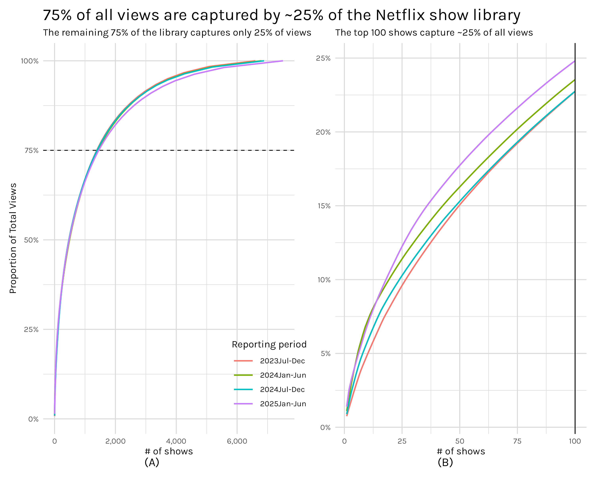{#fig-two .lightbox}

That is essentially how @fig-two can be interpreted: how many distinct shows[^2] does it take to reach 75% of all views. In plot A, we can see the answer is roughly 1,300 shows. Plot B simply zooms in and looks at what percentage of views the top 100 shows capture-roughly 25%. These numbers immediately perked my ears up because they are strikingly close to following the [pareto principle](https://en.wikipedia.org/wiki/Pareto_principle). The pareto principle says that 20% of some cause(in this case shows) accounts for 80% of the consequences(in our case views). This concept is closely related to power laws and we should be able to check if our distribution follows a power law by [scaling both our x and y axes logarithmically](https://clauswilke.com/dataviz/ecdf-qq.html) and checking to see if the data follows a straight line.

[^2]: Our dataset treats different seasons of a series as different shows. For example, Bridgerton: Season 1 and Bridgerton: Season 2 are two distinct shows.

```{r, cumulative_views_logged_axes}
logged_plot <- shows_cleaned |> 
    calculate_grouped_cumulative_sum(grouping_var = report, grouped_cumsum = TRUE) |> 
    ggplot(aes(x = row_num, y = view_share, color = report))+
    geom_line(linewidth = .8)+
    my_plot_theme()+
    labs(x = "# of shows",
         y = "Proportion of Total Views",
         color = 'Reporting period',
         title = '75% of all views are captured by ~25% of the Netflix show library',
         subtitle = 'The remaining 75% of the library captures only 25% of views'
         )+
    geom_hline(yintercept = .75, linetype = 'dashed', color = 'gray8')+
    theme(
        legend.position = 'inside',
        legend.key.width = unit(10, 'mm'),
        legend.position.inside = c(.9, .15)
    )+
    scale_x_log10(label = scales::label_comma())+ 
    scale_y_log10(label = scales::percent_format())
# ggsave("logged_plot.png", logged_plot, width = 10, height = 8)
```

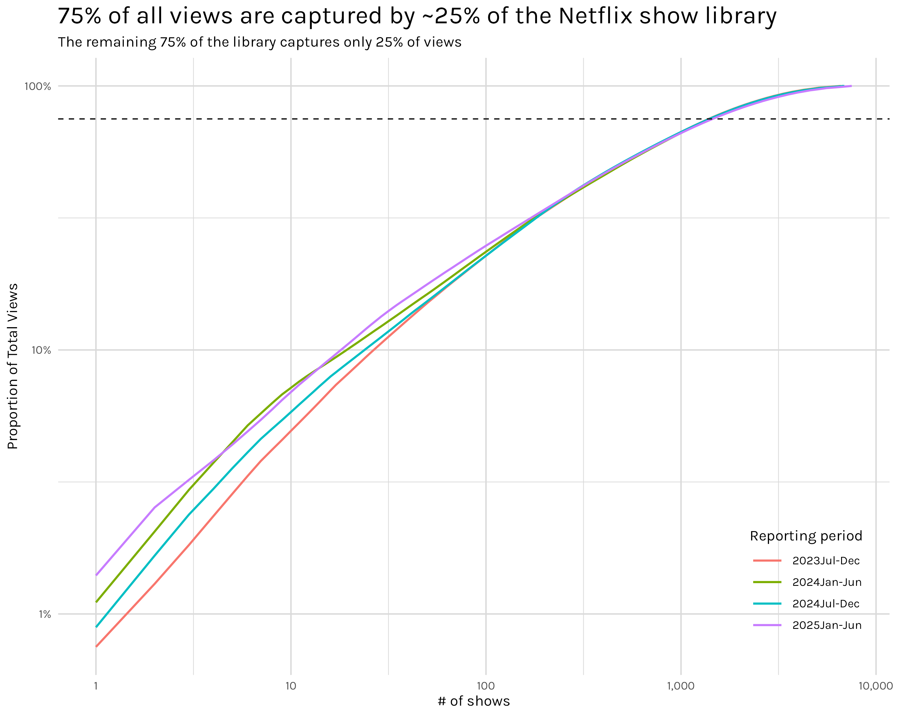{#fig-three .lightbox}

The data in @fig-three *almost* follows a straight line, but not quite[^dashed-line]. That should mean it doesn't follow a power law, but it sure is close. This isn't a satisfying answer, but I couldn't put my finger on what exactly bothered me. After an embarrassingly long time, I think I realized what is going on. My insight came when I reread the #tidytuesday [data dictionary](https://github.com/rfordatascience/tidytuesday/blob/main/data/2025/2025-07-29/readme.md): *"This report, which captures \~99% of all viewing in the first half of 2025"*. I knew that, but I missed a fairly obvious implication of that seemingly minor detail. To see what I mean let's do some quick napkin math.

[^dashed-line]: The dashed line here is the same 75% of total views indicator from @fig-two, but the log scale on the y-axis shifts the line upwards relative to the x-axis.

The 2025 Jan-June report in our dataset(one of four six month report periods) has a total of ~10.5 billion views and ~7,500 shows. If 99% of viewing is \~10.5 billion total views, that last percent is probably something like \~100 million views. Given that \~1,900 of the 7,500 shows in the report have 100,000 views(the lowest amount shown in our dataset), it seems logical to assume that most/all of the shows in the excluded 1% have fewer than 100,000 views and thus we could be looking at potentially thousands of shows which were excluded from the report. I can't say for sure since Netflix, to my knowledge, doesn't make a list of their full library publicly available, but it sure seems like we are dealing with a dataset that is a lot more truncated than it appears--at least for the really specific purpose I'm using it for. I think this effect could be even larger given that not only do the tails appear to be quite truncated, but the view counts themselves are heavily rounded and/or binned. \~1,900 shows didn't all miraculously have *exactly* 100,000 views. That is some form of rounding and/or binning and without knowing more specifics about the methodology and the missing 1% of views I don't think I can conclusively say whether the distribution follows a power law or not.

Putting the power law shenanigans aside, this is still, I think, a really interesting result. Just 100 shows are needed to cover nearly 25% of all views on Netflix. That is mind-boggling and brings up so many questions. Perhaps the one I'm most interested in--but one which I can't remotely answer with the data in this dataset--is how do these viewing rates relate to the way Netflix displays shows to you. For example, when Stranger Things has a new season, you can be sure that it will show up on the landing page when you open Netflix, probably for quite some time. That placement on an immediately visible and accessible page promotes viewership, but by how much exactly? And on the other side of things, how much does a show being hidden 15 rows deep(or not displayed at all in Netflix's suggested shows) hinder viewership? Inside Netflix I am sure there are whole analytics teams doing A/B testing to figure these sorts of numbers out, but I would love to get my hands on the data I'd need for this sort of analysis.

### A Brief Note on Empirical Cumulative Distribution Functions

As I noted in the introduction, my cumulative view plots sure sound an awful lot like an empirical cumulative distribution function plot. And that's true, they are similar, but subtly different. To see the difference in their interpretation, let's look at them side by side.

```{r, cumulative_view_ecdf_comparison_plot}
ecdf_plot <- shows_cleaned |> 
    filter(!is.na(views)) |> 
    ggplot(aes(x = views, color = report))+
    stat_ecdf(pad = FALSE, linewidth = .8)+
    geom_vline(xintercept = 10000000, linetype = 'dashed')+
    annotate('text', x = 75000000, y = .95, label = '~97% of shows have 10 million views or fewer')+
    my_plot_theme()+
    scale_x_continuous(labels = scales::label_number(scale_cut = scales::cut_short_scale()))+
    scale_y_continuous(labels = scales::percent_format())+
    theme(
        legend.position = 'inside',
        legend.key.width = unit(10, 'mm'),
        legend.position.inside = c(.8, .125)
    )+
    labs(x = '# of views(Millions)',
         y = 'ECDF',
         subtitle = 'ECDF plots display the proportion of shows\n that had X number of views or fewer',
         color = 'Reporting Period')

full_shows_ecdf_comp <- full_shows+
        labs(title = 'Comparison of Cumulative Viewing vs ECDF plots',
                 subtitle = 'Cumulative viewing plots display how many shows you\n must lump together to reach X proportion of total views')

comparison_plot <- (full_shows_ecdf_comp + ecdf_plot)+
    plot_annotation(tag_levels = "A", tag_prefix = "(", tag_suffix = ")") & theme(plot.tag.position = 'bottom') 
# ggsave('comparison_plot.png', comparison_plot, width = 10, height = 8)
```

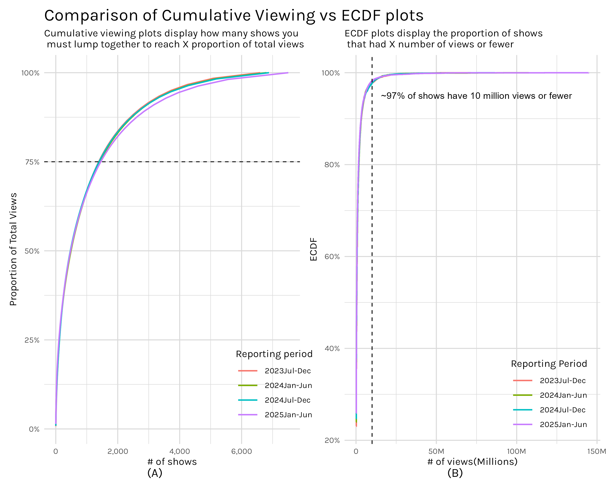{#fig-four .lightbox}

Plot A in @fig-four is the now familiar cumulative viewing plot. Moving from left to right on the plot, we are stacking up the views of shows, always taking the next most viewed show, and adding them together to give us the cumulative views of the X most viewed shows. So if we want to see how many shows are needed to reach 75% of all views, we just locate where our curve intersects the 75% threshold and we get \~1,300 shows equal \~75% of total views.

In contrast, plot B asks 'how many shows have at least X views'? If we pick a X value, say 10 million views(illustrated by our vertical dashed line), we can say that everything to the left has fewer than 10 million views and everything to the right has 10 million views or more. With this, we can say that 97% of shows had 10 million views or fewer.

So as you can see, these are two distinct ways of quantifying the same metric-views. Their shapes look quite similar precisely because they are handling the same information, but the way they are presenting it allows you to answer two different questions. With my cumulative views approach, you can answer questions like 'how much of total viewership is represented by X number of shows' while the ECDF plots answer questions like 'how many shows got at least X views'? Which one of these is better? Well, neither. They just answer different questions and I think it's good to have them both in your toolbox.

One thing that pops out when viewing @fig-four, especially plot B, is how annoyingly little detail we can see. If I squint I can tell what's going on in the middle regions, but out in the tails it's very difficult to extract detail. We can improve this by logging the axes like we did in @fig-three, but this time we are using the transformation to help us interpret the plot, not to test for a power law.

```{r, logged_cumulative_view_ecdf_comparison_plot}
ecdf_log_plot <- shows_cleaned |> 
    filter(!is.na(views)) |> 
    ggplot(aes(x = views, color = report))+
    stat_ecdf(pad = FALSE, linewidth = .8)+
    geom_vline(xintercept = 10000000, linetype = 'dashed')+
    my_plot_theme()+
    scale_x_log10(labels = scales::label_number(scale_cut = scales::cut_short_scale()))+
    scale_y_log10(labels = scales::percent_format(), minor_breaks = scales::minor_breaks_log(detail = 1))+
    theme(
        legend.position = 'inside',
        legend.key.width = unit(10, 'mm'),
        legend.position.inside = c(.8, .125)
    )+
    labs(x = '# of views(Millions)',
         y = 'ECDF',
         subtitle = '',
         color = 'Reporting Period')

full_shows_ecdf_comp_logged <- full_shows+
        scale_x_log10()+ 
        scale_y_log10(labels = scales::label_percent(), minor_breaks = scales::minor_breaks_log(detail = 1))+
        labs(title = 'Comparison of Cumulative Viewing vs ECDF plots, logged axes',
                 subtitle = 'Logged axes reveal the binning of view counts in the ECDF plot and allows for a much more fine grained\n examination of the curves in both plots')

comparison_plot_logged <- (full_shows_ecdf_comp_logged + ecdf_log_plot)+
    plot_annotation(tag_levels = "A", tag_prefix = "(", tag_suffix = ")") & theme(plot.tag.position = 'bottom') 
# ggsave('comparison_plot_logged.png', comparison_plot_logged, width = 10, height = 8)
```

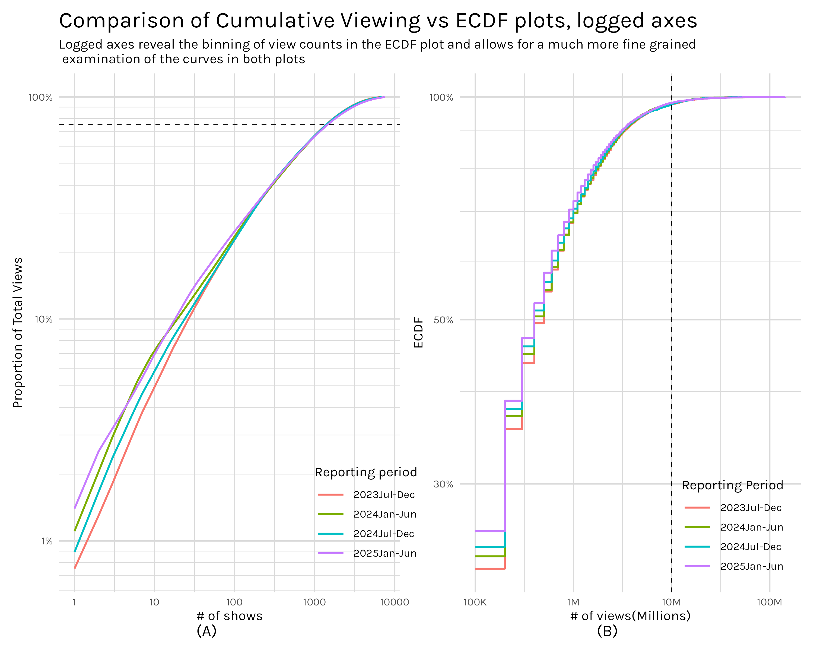{#fig-five .lightbox}

With our axes logged, both plots allow finer probing of the tails.[^grid-lines] Plot B of @fig-five has a stepped appearance which reveals that the view counts are discrete and binned. We can also extract much more information from the sub 10 million views portion of plot B. For example, I can see that 70% of shows have 1 million views or less, a data point that was lost in the tail before. 

[^grid-lines]: What's with the odd spacing of the grid lines in @fig-five? Welcome to the world of logged axes. The plots are basically showing orders of magnitude. So in plot A, the y-axis lines between 1% and 10% are all 1% increases, while the lines between 10% and 100% are all 10% increases. In plot B, the y-axis lines are *all* 10% increase. A little confusing, but ultimately quite helpful.

## How Does Viewing Change Across Reports?

Now on to my second question: How does viewing change across the four reports in the dataset? What exactly is this question asking? Do we want to know how Netflix's total viewership changes across the reporting periods? Or maybe we are more interested in how views for a single series change across the four reports. Even there, do we want to know the season by season change or the total change(or mean; or median) in views across all seasons? Perhaps we actually care about how views change when a new season of a show premieres. Do the other seasons of that series get a bump in views? How big is that bump?

As you can see, this seemingly simple question is not particularly well specified. Since I'm in charge here(mwahaha), I'm going to divide this into two parts. Generally, part one will look at viewership at some level of aggregation. Does the overall level of viewing change? Do we see any difference when we examine views by report and season? How much effect does a new season typically have on older seasons? For those shows that don't have a view injection from a new season, how quickly does viewership typically decay and is this effect different for seasonal shows versus limited series? And finally, what is the typical lift/decay between new seasons of a series-i.e. are new seasons of a series typically more popular or less popular than the last new season?

In part two, I'll look at viewership for individual series and seasons: does Stranger Things have a big drop in views from one season to the next; how much of a lift did a new season of Bridgerton provide to old seasons? I'll address many of the same questions from part one, but from the perspective of a single show. In essence, part one will, hopefully, give us some useful intuition into how show viewership typically behaves and part two will highlight how selected shows actually behaved.

Let's get started!

### Overall Netflix Viewership

Let's get started with a baseline. How much are people watching on Netflix and is that number going up or down.

```{r, total_views_by_report}
total_views_tbl <- shows_cleaned |> 
  ungroup() |> 
  summarise(total_views = sum(views, na.rm = TRUE), .by = report_date) |> 
  arrange(report_date) |> 
  mutate(dropoff = (total_views - lag(total_views, 1))/lag(total_views, 1) *100) |> 
  select(report_date, total_views, dropoff) |> 
  # rename is for better formatting of col names in table
  rename(`report date` = report_date, `total views` = total_views) |> 
  gt() |> 
  fmt_number(
    columns = `total views`,
    rows = everything(),
    decimals = 0
  ) |> 
  fmt_percent(
    columns = dropoff,
    rows = everything(),
    decimals = 3,
    scale_values = FALSE
  ) |> 
  format_table_header() |> 
  format_table_style()

# gtsave(total_views_tbl, 'total_views_tbl.png')
```

```{r, series_in_top_100_views_by_report}
top_shows_by_report <- shows_cleaned |> 
  ungroup() |> 
  arrange(desc(views)) |> 
  slice_head(n = 100) |> 
  group_by(report_date) |>
  count() |> 
  ungroup() |> 
  rename(`# shows` = n,
         `report date` = report_date) |> 
  gt() |> 
  format_table_header() |> 
  format_table_style()

# gtsave(top_shows_by_report, 'top_shows_by_report.png')
```

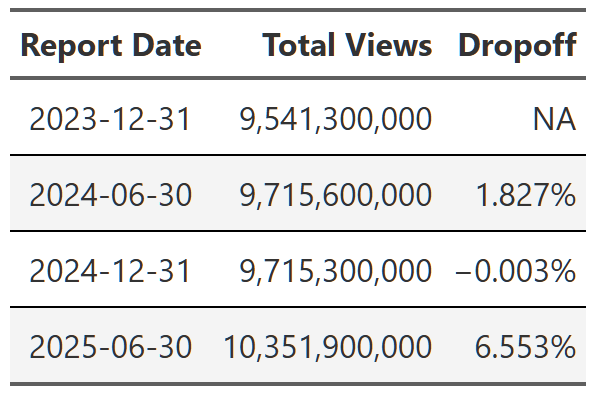{#tbl-total-views .lightbox}

@tbl-total-views is simply the sum of all views in each reporting period. As a reminder, these reports are six month periods, so, for example, report date 2025-06-30 is the viewing period from January to the end of June in 2025. Viewing is relatively flat until the last report where we see a big 6.5% bump. Intuitively, 6.5% seems like a big increase from one six month period to the next, so I quickly looked at the 100 most viewed shows in the dataset and grouped them by report date[^3]. @tbl-most-viewed-shows is the result. I don't know what happened, but the 2025 report had significantly more top shows than any of the previous reports. If you add up the views of these 100 shows most of the 6.5% difference appears to come from this small group. The 2025 report has \~500 million more views from these top 100 shows than any other report. I'm not going to dive into this, but it's something to keep in mind.

[^3]: This is not a perfect way to do this grouping. Most, but not all, of the time this grouping captures which period the show debuted in. A small handful of times- when the show debuted before any of these reports or when a new season massively bumps an old season-a show that debuted in a older report will get mistakenly grouped with a newer report. After reviewing the data it didn't make any difference in this case, so I went ahead with this simpler, imperfect grouping.

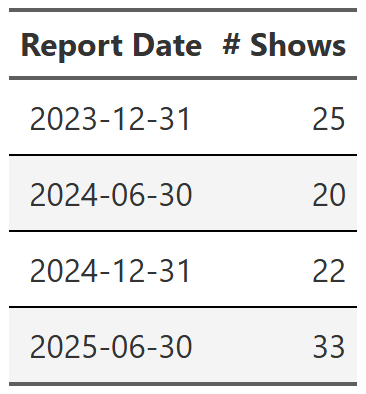{#tbl-most-viewed-shows .lightbox}

#### Total Viewing by Season and Report

```{r, table_building_functions}
# calculates dropoff rate of shows by specified grouping variables
# can be many different variables, but this logic is still fairly brittle, so use with caution
calc_table_data <- function(data, summary_func = sum,  ...){
  
  grouping_vars <- enquos(...)
  
  # create naming variables to handle the summary_func possibilities
  stat_name <- as_label(enquo(summary_func))
  display_name <- if(stat_name == 'sum') 'total' else stat_name
  col_name <- rlang::sym(glue::glue("{display_name}_views"))
  

  working_df <- data |>
      # data should be ungrouped coming into this function, but explicitly ungroup for safety
      ungroup() |>
      group_by(!!!grouping_vars) |>
      mutate(contains_new_season = case_when(
                                    new_release %in% c( "New Season", "New Season Lift") ~ TRUE,
                                    .default = FALSE)) |>
      summarise(!!col_name := rlang::exec(summary_func, views, na.rm = TRUE),
                contains_new_season = any(contains_new_season),# logical flag per series per report_date
                .groups = 'drop')  |>
      arrange(!!!grouping_vars)
  
  if(length(grouping_vars) > 1){
    final_df <- working_df |> 
      group_by(!!grouping_vars[[1]]) |>
        mutate(dropoff = (!!col_name - lag(!!col_name, 1))/lag(!!col_name, 1) *100,
               dropoff = if_else(is.na(dropoff), !!col_name, dropoff),
               is_first_row = row_number() == 1,
               ) |>
        ungroup() |>
        complete(!!!grouping_vars, fill = list(contains_new_season = FALSE))
      final_df
      
  }else{
  final_df <- working_df |> 
    ungroup() |>
      mutate(dropoff = (!!col_name - lag(!!col_name, 1))/lag(!!col_name, 1) *100,
             dropoff = if_else(is.na(dropoff), !!col_name, dropoff),
             is_first_row = row_number() == 1,
             ) |>
      ungroup() |>
      complete(!!!grouping_vars, fill = list(contains_new_season = FALSE))
  final_df
  }

}    

build_formatted_table <- function(data, add_conditional_highlights = TRUE, ...){
  groups <- enquos(...)
  
  base_table <- data |>
      select(!!!groups, dropoff) |>
      pivot_wider(names_from = !!groups[[1]], values_from = dropoff) |>
      gt() 
  
  # create a set of named vectors containing the logic for conditionally formatting table
  conditional_formatting_flag <- data |> 
    group_by(!!groups[[1]]) |> 
    summarise(
      logic_data = list(
        list(
          new_season_flag = contains_new_season,
          first_row_flag = is_first_row
      )), .groups = "drop") |> 
    deframe()
  
  # build conditionally formatted table
  final_table <- 
    reduce(
        names(conditional_formatting_flag),
        .init = base_table,
        function(gt_obj, current_item){
          
          #gather conditional flags
          flags <- conditional_formatting_flag[[current_item]]
          
          
          result <- gt_obj |> 
            fmt_number(
              columns = all_of(current_item),
              rows = flags$first_row_flag,
              decimals = 0
            ) |> 
            fmt_percent(
              columns = all_of(current_item),
              rows = !flags$first_row_flag,
              decimals = 2,
              scale_values = FALSE
            )
          
          if(add_conditional_highlights){
            result <- result |> 
              tab_style(
                style = cell_fill(color = 'white'),
                locations = cells_body(
                  columns = all_of(current_item),
                  rows = flags$first_row_flag
                )
              ) |> 
              #apply new season formatting
              tab_style(
                style = cell_fill(color = 'yellow', alpha = .5),
                locations = cells_body(
                  columns = all_of(current_item),
                  rows = flags$new_season_flag 
                )
              )
          }
          return(result)
          }
    )
    final_table |>
      format_table_header() |>
      format_table_style()
}
```

Diving down one level of aggregation we can look at how total viewing changes across the four reporting periods.[^4]

[^4]: At this point, since I know I'm going to be building a lot of different tables, I'm going to build a couple general purpose table functions to speed things up. I'm not going to go into their details, but they are worth a look in the code fold if you are interested in reproducing some of this report.

```{r, all_seasonal_shows}
seasonal_all_shows <- shows_cleaned |> 
  filter(season %in% paste0("Season ", 1:7)) |>
  calc_table_data(season, report_date, summary_func = sum) |> 
  build_formatted_table(add_conditional_highlights = FALSE, season, report_date)

 # gtsave(seasonal_all_shows, "seasonal_all_shows.png")
```

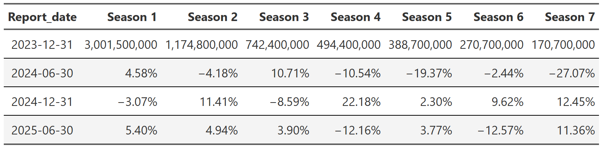{#tbl-by-season-report .lightbox}

@tbl-by-season-report shows the total views by season and report. The first row is the total views each season got in the 2023 report and then every subsequent row is the increase or decrease in views from the previous report. For example, we see that for season 1 of all shows in the dataset, there were \~3 billion views in the 2023 report and then \~4.5% more views in the 2024-06 report. We can see a couple things from this table. First, total views between seasons are highly varied. Season 1's have \~3 billion views in the 2023 report, but season 7's only have \~170 million! This seemed quite interesting at first, but then I realized something obvious--aren't there way more shows that have a season 1 than a season 7[^5]?

[^5]: Why did I stop at season 7? Well, I had to stop somewhere as some shows have over 20 seasons. Up to season 7-ish there are still a lot of shows in the dataset so I felt relatively comfortable with the numbers being meaningful and not completely driven by the behavior of one or two shows.

```{r, number_of_shows_with_season_x}
show_count <- shows_cleaned |> 
  ungroup() |> 
  filter(season %in% paste0("Season ", 1:7)) |> 
  summarise(total_shows = n(), .by = c(report_date, season)) |> 
  arrange(report_date, season) |> 
  filter(report_date == '2023-12-31') |> 
  pivot_wider(names_from = season, values_from = total_shows) |> 
  gt() |> 
  format_table_header() |> 
  fmt_number(
    columns = everything(),
    rows = everything(),
    decimals = 0
  ) 

# gtsave(show_count, "show_count.png")
```

As you can see from @tbl-season-cohort, yes! It's not that season 1's are much more popular than other seasons, it's that there are simply *more* season 1's in the dataset.

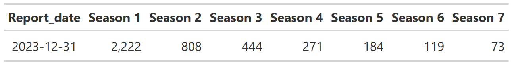{#tbl-season-cohort .lightbox}

The second thing you can observe in @tbl-by-season-report is more interesting--notice how relatively stable the season views are between reports. Season 1 views stay within \~5% of the last report and it's generally similar across the table. I am not saying there aren't spikes. There obviously are. But it seems like those spikes occur more often in later seasons where there are fewer total views and thus a single show or two has more impact on the overall numbers.

We can examine this briefly by dividing the dataset into two groups, one where shows had a new season come out and the other where they did not. Essentially we chunk the data from each show by report. For example, Black Mirror had a new season premiere in 2025 so all seasons of Black Mirror in the 2025 report go into the 'new season' group. In the other three reports--2023 and the two 2024 reports--Black Mirror didn't have a new season premiere, so those three chunks of Black Mirror data go into the 'no new seasons' group. We do this for every show in the dataset and now we have two datasets, one full of shows that didn't have any new seasons during the report and one full of shows that did have new seasons. The results of this are @tbl-no-new-seasons and @tbl-only-new-seasons.

```{r}
no_new_seasons <- shows_cleaned |> 
  filter(season %in% paste0("Season ", 1:7)) |>
  group_by(series, report_date) |> 
  filter(!any(new_release == 'New Season Lift')) |> 
  calc_table_data(season, report_date, summary_func = sum) |> 
  build_formatted_table(add_conditional_highlights = FALSE, season, report_date)

new_seasons <- shows_cleaned |> 
  filter(season %in% paste0("Season ", 1:7)) |>
  group_by(series, report_date) |> 
  filter(any(new_release == 'New Season Lift')) |> 
  calc_table_data(season, report_date, summary_func = sum) |> 
  build_formatted_table(add_conditional_highlights = FALSE, season, report_date)

# gtsave(no_new_seasons, "no_new_seasons.png")
# gtsave(new_seasons, "new_seasons.png")
```

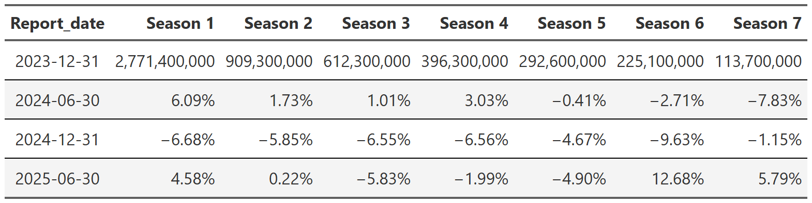{#tbl-no-new-seasons .lightbox}

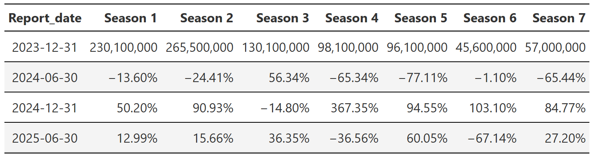{#tbl-only-new-seasons .lightbox}

As you can see in @tbl-no-new-seasons, the view variance for the data without any new seasons is much lower than the full dataset. Contrasting this with @tbl-only-new-seasons the difference is night and day. There is much less data(look at the 'starting' view counts in the first rows), so you'd expect these numbers to jump around more, but these numbers appear totally driven by whether a popular show happened to have a new, for instance, 5th season launch in the 2025 report. This illustrates nicely how limited this way of aggregating is. Perhaps there are better ways to look at this data...

#### What Sort of Effect Does a New Season Release Have on Old Seasons?

Looking at total viewership like we did above is a perfectly worthwhile endeavor, but it can't be used to answer one of the questions I'm(and certainly Netflix) most interested in: how much of an effect(lift) does the release of a new season have on the viewership of old seasons. If you are in the entertainment business, this has to be one of your key metrics. If you know this number and you know what shows are currently in production, then you can make a pretty good guess at what your viewership numbers will look like in the next month/quarter/year/etc. Calculating this is simple, but easy to mess up. What we want is the mean percent difference in views from the last period, but we only want this for reports where a new season has premiered. For example, say a show releases a fifth season during 2025 report. The only data I'm interested in for this calculation is the difference in season 1-4 views from the report prior to the 2025 report. The code in the fold[^6] calculates this percent change for each individual show and then takes the mean to give us the average lift a new season provides to e.g. season 1 viewing.

[^6]: You can see in the code fold that there is a lot of grouping and ungrouping, but it is all necessary to make sure we are calculating within the correct groups at the correct time.

```{r, new-season-lift-mean}
# New season lift
new_season_lift <- shows_cleaned |>
  ungroup() |> 
  filter(season %in% paste0("Season ", 1:9)) |> 
  mutate(report_date = as.Date(report_date)) |> 
  # want total views by show, season and report
  group_by(series, season, report_date) |> 
  summarise(total_views = sum(views, na.rm = TRUE),
            contains_new_season = any(new_release %in% c("New Season Lift"))) |> 
  arrange(season, report_date) |> 
  ungroup() |> 
  group_by(series, season) |> 
  mutate(dropoff = (total_views - lag(total_views))/lag(total_views)) |>
  ungroup() |> 
  group_by(series) |> 
  # can't calculate lift from a new season occuring in the first report-it's the first report
  filter(report_date != min(report_date)) |> 
  ungroup() |> 
  group_by(series, season) |> 
  # after lift/decay from previous season calculated, filter to only series(season) where a new season released during that report
  filter(contains_new_season == TRUE) |> 
  ungroup() |> 
  group_by(season, report_date) |> 
  summarise(avg_lift = mean(dropoff, na.rm = TRUE)) |> 
  arrange(season, report_date) |> 
  pivot_wider(names_from = season, values_from = avg_lift) |> 
  gt() |> 
  format_table_header() |> 
  format_table_style() |> 
  format_table_numbers(scale_vals = TRUE)

# gtsave(new_season_lift, "new_season_lift.png")
```

```{r, new-season-lift-median}
new_season_lift_median <- shows_cleaned |>
  ungroup() |> 
  filter(season %in% paste0("Season ", 1:9)) |> 
  mutate(report_date = as.Date(report_date)) |> 
  # want total views by show, season and report
  group_by(series, season, report_date) |> 
  summarise(total_views = sum(views, na.rm = TRUE),
            contains_new_season = any(new_release %in% c("New Season Lift"))) |> 
  arrange(season, report_date) |> 
  ungroup() |> 
  group_by(series, season) |> 
  mutate(dropoff = (total_views - lag(total_views))/lag(total_views)) |>
  ungroup() |> 
  group_by(series) |> 
  # can't calculate lift from a new season occuring in the first report-it's the first report
  filter(report_date != min(report_date)) |> 
  ungroup() |> 
  group_by(series, season) |> 
  # after lift/decay from previous season calculated, filter to only series(season) where a new season released during that report
  filter(contains_new_season == TRUE) |> 
  ungroup() |> 
  group_by(season, report_date) |> 
  summarise(avg_lift = median(dropoff, na.rm = TRUE)) |> 
  arrange(season, report_date) |> 
  pivot_wider(names_from = season, values_from = avg_lift) |> 
  gt() |> 
  format_table_header() |> 
  format_table_style() |> 
  format_table_numbers(scale_vals = TRUE)

# gtsave(new_season_lift_median, "new_season_lift_median.png")
```

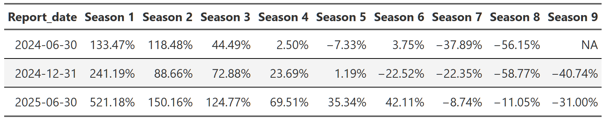{#tbl-new-season-lift .lightbox}

@tbl-new-season-lift is the result of this calculation. As you'd expect, new seasons do lift the viewership of older seasons. Intuitively we understand this. Say two or three years have passed since your favorite show last had a new season. You might want to rewatch all those old seasons so you remember what was going on. Or you may be a new viewer who saw the advertising for the new season and that prompted you to dig back into the library so you could experience the show from the beginning. @tbl-new-season-lift gives concrete data to this intuition. A new season release raises the views of season 1 of that series by between 133-521% depending on the report. What's more, this lift decreases season-on-season. So a new season lifts season 1 views a lot, but it lifts the views of season 2, 3, etc. less and less. Maybe people are most nostalgic for the early seasons so those are most likely to get rewatched. Maybe new viewers watch just the first season or two so that they know what is going on in the new season. Maybe the release cadence of shows with 8, 9, 10 seasons is such that viewers don't feel the need to refresh their memory since the last season didn't premiere *that* long ago. I can think of all sorts of reasons why this lift might decay over the seasons, but the fact that the new season lift is so pronounced in the early seasons seems pretty important. New seasons not only draw a bunch of views to the new release itself, they draw new views to the old seasons too. In a sense, you could add the bump in views the old seasons get to the views of the new release to get the 'true' impact on views of the new release. These new seasons extend the lifespan of the show on both ends-the new seasons feed new and older viewers alike back into the show's pipeline to watch the previous seasons, extending the viewing time the show can extract from the subscriber.

One final point about @tbl-new-season-lift. This calculation still suffers from the small data problem encountered in the previous section when we get to the later seasons--really seasons above, say, season 6. There are just not that many shows that had a new 6th season release in the dataset, so the calculations for these later season lifts are based on a small handful of shows. That means they should be taken with a healthy dose of skepticism since a single show can wildly skew the numbers for a reporting period. Why didn't I take a median instead of a mean to alievate some of this concern? Well, I did[^median-alt], it just didn't really change much and more people understand mean than median.

[^median-alt]: 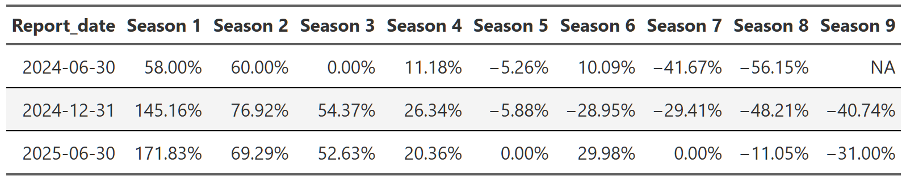{#tbl-new-season-lift-median .lightbox}

#### How Quickly Does Viewing Decay for Shows Without New Seasons?

Now that we more or less know the effect of a new release on views, a logical next question is what about those shows that don't have the benefit of a new season bump? Are their viewing numbers just permanently decaying? Calculating this is quite similar to the lift calculation above, but the grouping is slightly different and we are filtering out a different subset of the data. We are only looking at show seasons that have been in all four reports and that were in maintenance(i.e. they didn't have a new season release) that entire time. Ideally, I wouldn't need to restrict this to shows that were in all four reports, but for certain 'reasons'[^8] this is necessary to ensure our comparisons are comparing what we think they are.

[^8]: Sometimes a show will have seasons 1 and 2 in the 2023 report and then seasons 1 and 4 in the next report. This combined with the way shows are classified under new_release(by a binning of release_date, which not all shows have) means that in order to make sure our comparisons aren't accidently skewed by new entries into the dataset(that functions very similarly to a new season) we have to restrict the data we are working with to show seasons that are present in all four reports.

```{r, maintenance-show-decay-median}
# maintenance shows  
maintenance_decay_median <- shows_cleaned |> 
  group_by(series, season) |> 
  filter(n_distinct(report_date) == 4) |>
  filter(season %in% paste0("Season ", 1:9)) |> 
  filter(all(new_release == 'Maintenance')) |> 
  group_by(series, season) |>
  arrange(series, season, report_date) |> 
  mutate(dropoff = (views - lag(views))/lag(views),
         dropoff = if_else(is.na(dropoff), views, dropoff)) |> 
  ungroup() |> 
  group_by(season, report_date) |>
  summarise(median_decay = median(dropoff, na.rm = TRUE)) |>  
  arrange(season, report_date) |> 
  pivot_wider(names_from = season, values_from = median_decay) |> 
  gt() |> 
  format_table_header() |> 
  format_table_style() |> 
  format_table_numbers(scale_vals = TRUE) |> 
  fmt_number(columns = everything(),
             rows = report_date == '2023-12-31',
             decimals = 0)
  
# gtsave(maintenance_decay_median, "maintenance_decay_median.png")
```

```{r, maintenance-show-decay-mean}
# maintenance shows  
maintenance_decay_mean <- shows_cleaned |> 
  group_by(series, season) |> 
  filter(n_distinct(report_date) == 4) |>
  filter(season %in% paste0("Season ", 1:9)) |> 
  filter(all(new_release == 'Maintenance')) |> 
  group_by(series, season) |>
  arrange(series, season, report_date) |> 
  mutate(dropoff = (views - lag(views))/lag(views),
         dropoff = if_else(is.na(dropoff), views, dropoff)) |> 
  ungroup() |> 
  group_by(season, report_date) |>
  summarise(median_decay = mean(dropoff, na.rm = TRUE)) |>  
  arrange(season, report_date) |> 
  pivot_wider(names_from = season, values_from = median_decay) |> 
  gt() |> 
  format_table_header() |> 
  format_table_style() |> 
  format_table_numbers(scale_vals = TRUE) |> 
  fmt_number(columns = everything(),
             rows = report_date == '2023-12-31',
             decimals = 0)
  
# gtsave(maintenance_decay_mean, "maintenance_decay_mean.png")
```

Anyway, @tbl-maintenance-decay-median shows the results of this calculation and they are pretty informative[^9], but a little explanation is needed. Most seasons do decay when a show is in maintenance mode. Unlike with the lift calculations above, this effect appears quite consistent across all seasons. What *is* unusual is the solid row of zeros for the 2025 report. What the heck is that? Well, hopefully you noticed that @tbl-maintenance-decay-median uses median calculations. This was to lessen the impact of single shows in the later seasons that have fewer shows, but this also produced the zeros. Why? Because of the way the views are binned[^10], it is not uncommon for these maintenance shows to have the same number of views from report to report. So when you order these decay calculations to determine the median, you wind up with a whole lot of zeros in the middle and so the median ends up being zero. Essentially, the most common(yes, I know that's the mode) decay amount for maintenance shows after they've been in maintenance for a while is for their numbers to go unchanged. This doesn't seem unreasonable to me at all, but if you are scared by this, I'll include the mean table in the footnotes[^11]. 

I think my takeaway from this is that once a show is in maintenance, views will decline steadily, but they can only go so far(at least in this dataset). Eventually, you reach a level where most people have stopped watching, but people who are superfans(think something like The Office where people rewatch over and over) continue to watch no matter how many times they've seen it. Perhaps they put it on for ambient noise during dinner or they use it to fall asleep to at night. The point is, it seems entirely reasonable that shows in maintenance could settle on a view plateau where some subset of subscribers will continue to watch until the show is pulled from the library.

[^9]: Isn't this table calculating something similar to @tbl-no-new-seasons? Yes, but the subset of data is different--for the reasons outlined in the last footnote--which results in a cleaner comparison of shows that don't get the view bump of new seasons appearing in the dataset.

[^10]: Views are rounded and/or binned in some unspecified way. So we have, on the low end, values like 50,000 or 100,000 views, never 52,183. This means that when we compare shows with low viewership across reports and seasons, they often wind up having the same view number time and time again. Obviously, the exact same number of people didn't view these shows every report, but for many different reasons, that's how Netflix chooses to release this viewing data.

[^11]: 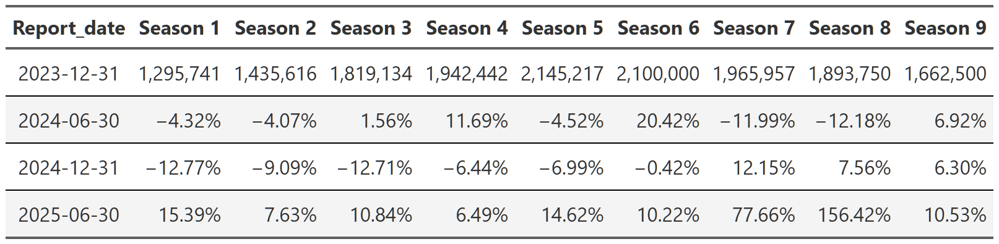{#tbl-maintenance-decay-mean .lightbox}

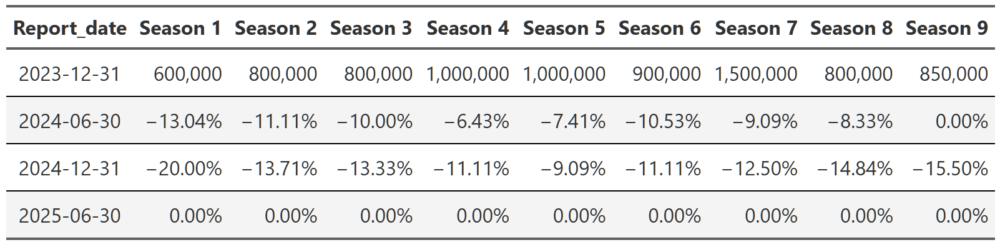{#tbl-maintenance-decay-median .lightbox}

#### Does Maintenance Decay Look Any Different for Limited Series?

In the last section we looked at seasonal shows in maintenance, but there are also, as Netflix calls them, Limited Series aka Mini-Series. These are one-off series that are conceived from the beginning as a single set of episodes telling a complete story. These are often extremely popular(the most viewed show in the dataset, Adolescence, is a Limited Series), but they are also more limited in their reach. As we saw with the new release lift calculations, new seasons of seasonal shows not only inject a bunch of new views into the new release, they bring views back to the older seasons as well. Limited series don't get the benefit of those new release bumps, so I would expect their views to start strong and then drop off steadily in each successive report.

```{r, limited_series_decay}
limited_series_decay <- shows_cleaned |>
  group_by(series, season) |> 
  filter(n_distinct(report_date) == 4) |>
  ungroup() |> 
  filter(season == 'Limited Series') |> 
  group_by(series) |>
  arrange(series, report_date) |> 
  mutate(dropoff = (views-lag(views))/lag(views),
         viral_show = max(views) > 15000000) |>  
  group_by(report_date, viral_show) |> 
  summarise(median_dropoff = median(dropoff, na.rm = TRUE)) |> 
  ungroup() |> 
  filter(report_date != '2023-12-31') |> 
  pivot_wider(names_from = viral_show, values_from = median_dropoff) |> 
  rename(`<10M peak views` = `FALSE`, `>10M peak views` = `TRUE`) |> 
  gt() |> 
  format_table_header() |> 
  format_table_style() |> 
  format_table_numbers(scale_vals = TRUE) |> 
  fmt_number(columns = everything(),
             rows = report_date == '2023-12-31',
             decimals = 0)

# gtsave(limited_series_decay, 'limited_series_decay.png')

```

This is basically what we see, but with one big caveat. @tbl-limited-series-decay shows the median report-over-report decline in views for limited series, but also subdivided into shows that peaked at 10 million views or more and those that did not. What we see is that the most popular shows suffer the most extreme dropoffs in views. The 'popular' series on average shed \~91% of their views from the first to last report period while the 'less popular' shows only shed \~35% of their views. This isn't some profound conclusion--no show can continue to draw 50 million views report after report--but this does illustrate the difference between a limited series and a seasonal show. You expect the limited series to burn brightly and then fade quickly. People like to watch what's popular so they can talk about it with their friends/family/colleagues. When that initial surge of virality is over, people move on to the next thing. With seasonal shows, you can keep building a fan base over many years. They can experience similar moments of virality when a new season releases, but they also have a back catalog their fans can go back to and sate their thirst while they wait out the content drought till the next season.

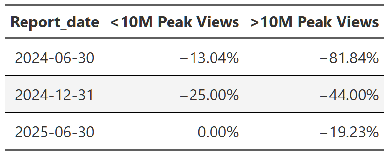{#tbl-limited-series-decay .lightbox}

#### Do New Seasons Get More or Less Popular as Series Go On?

The final question I want to address in this first section is what the trajectory of the new releases looks like. Essentially, are views of Bridgerton's new seasons growing season after season or has the viewership peaked and is now decaying? In many ways this is a silly question to ask in the aggregate--of course every show has a unique growth profile. Some are like Breaking Bad and grow season after season, attracting new viewers their entire run. Others start strong, but, for any number of reasons, fail to maintain that growth and wither over the seasons. Why I'm asking this question at the aggregate level is to see if I can get a sense of what you'd expect from any random show. If you don't know anything else about a show(other than the fact it was popular enough to be picked up for another season), what amount of growth/decay would you expect for their next new season?

We can calculate this pretty simply after we filter out the shows that had two or more new seasons release during the \~2 years covered by the dataset. This is a modest number of shows(80), but I can use some statistics to get a little more confidence in our numbers. @fig-six shows the distribution of the median percent change[^12] from one new season to the next. What I've done is generate a bootstrap distribution of 10,000 medians--essentially, I take the 80 original values, resample them with replacement, then calculate a median value. I do this 10,000 times and that gives me a sampling distribution of medians I can use to construct a confidence interval(the light green shaded region). With @fig-six we can see that the most likely change is \~-20%, but we shouldn't be surprised to see drops anywhere in the \~13-35% range. From this I can surmise that a typical show will lose viewership over its seasons. This doesn't mean no shows experience that Breaking Bad style growth from beginning to end, it just means it's relatively more common for shows to lose viewers rather than gain them.

[^12]: I actually use a logratio calculation here instead of a simple percent change. This is just log(views2/views1). I do this since the data could be otherwise skewed by the asymmetry of the percent change in views: i.e. a show could increase it's views by 1000%+, but it can only decrease it's views by -100%. Using the logratio alleviates that concern and then I can exponentiate at the end to convert back into nice interpretable percentages.

```{r, new_seasons_change, eval = FALSE}
library(infer)

multiple_new_season_shows <- 
  shows_cleaned |> 
  filter(new_release == 'New Season', show_type == "Multi Season", startsWith(season, 'Season ')) |>
  group_by(series) |> 
  filter(n() > 1) |>
  ungroup() |> 
  group_by(series) |> 
  arrange(series, as.numeric(season_number)) |> 
  #use a logratio to try to blunt the effects of the lift/decay imbalance-eg a show can increase it's views
  #by 10000%+, but it can only lose 100% of it's audience. logratio balances this out and I can exponentiate
  #at the end to get back to interpretable numbers
  mutate(logratio = log(views/lag(views))) |> 
  #there will be at least two rows for every show(first new season, second new season), but one of those will
  # be NA since it's the first value. I only want the lift/decay value
  filter(!is.na(logratio))

# create a bootstrap distribution of these 80 values
boot_dist <- multiple_new_season_shows |> 
  specify(response = logratio) |> 
  generate(reps = 10000, type = 'bootstrap') |> 
  calculate(stat = 'median')

# calculate the sample median
sample_median <- multiple_new_season_shows |> 
  specify(response = logratio) |> 
  calculate(stat = 'median')

# calculate 95% confidence interval; default is percentile method and with the small-ish sample size I'll
# stick with that. Both methods give approximately the same answer
ci <- boot_dist |> 
  get_confidence_interval(level = .95)


ci_bootstrap_dist <- boot_dist |> 
  mutate(stat = exp(stat) -1 ) |>
  visualize() +
  # shade_p_value(obs_stat = exp(sample_median)-1, direction = 'one_sided') +
  shade_confidence_interval(exp(ci) -1, alpha = .25)+
  my_plot_theme()+
  labs(title = 'Median % Change in Views(From Last New Season)',
       subtitle = 'Simulation-Based Bootstrap Distribution',
       x = 'Median % Change')+
  scale_x_continuous(labels = scales::percent_format())

ggsave("ci_bootstrap_dist.png", ci_bootstrap_dist, width = 10, height = 8)
```

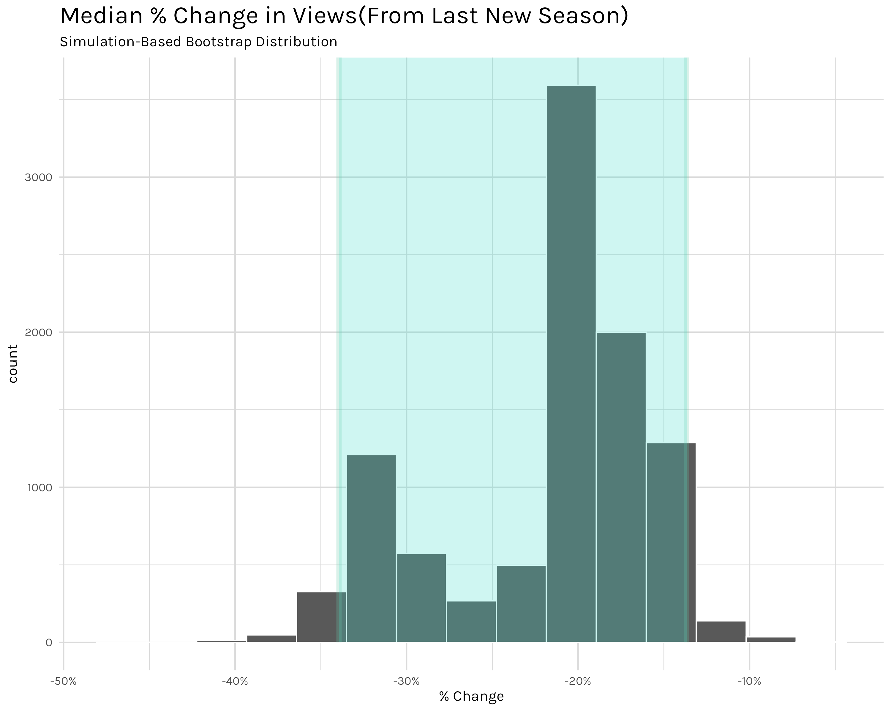{#fig-six .lightbox}

### Selected Shows Viewership

Finally we can move on to part two--looking at individual series. With this we are moving away from looking at the '*typical*' show and moving to the actual behavior of specific shows. I'm still interested in similar questions of new season lift and view decay, but now I'm concerned with how viewership health for Stranger Things or Bridgerton looks. It's worth noting at the outset that a combination of the two levels--comparing typical show behavior to specific show behavior--is certainly very valuable in a business setting, but I'm not going to be too concerned with that here. I simply want to examine how a handful of shows are doing. I'll leave the comparative analysis to a curious reader.

#### 'Older' Shows Without New Seasons

Let's start with a random(*cough* randomly chosen by me *cough*) set of popular shows that are older or don't have new seasons in the dataset.

```{r, total_views_by_show_per_report}
total_views_by_show_per_report <- shows_cleaned |> 
  filter(startsWith(series, 'Suits')| 
           series %in% c('Seinfeld', 'Breaking Bad', 'Arrested Development', 'Peaky Blinders', 'Stranger Things')) |> 
  calc_table_data(series, report_date, summary_func = sum) |> 
  build_formatted_table(add_conditional_highlights = TRUE, series, report_date)

# gtsave(total_views_by_show_per_report, "total_views_by_show_per_report.png")
```

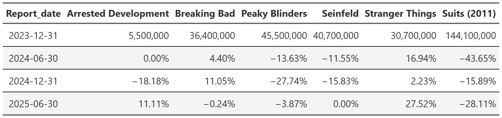{#tbl-total-views-by-show .lightbox}

In @tbl-total-views-by-show we are looking at the total views(sum of all seasons) of the selected shows. Before we start looking at the data, I just want to point out that since we are looking at total views, this will skew things slightly--shows with more seasons-like Suits and Seinfeld-will probably have more views. I could, and did, look at the mean views per season, but the analysis doesn't really change and I think the total is a more intuitive way to convey how many eyeballs these shows are capturing for Netflix.

We can see that Breaking Bad and Seinfeld still drew in \~36 million and \~40 million views respectively in the 2023 report even though they went into syndication a decade ago with Breaking Bad and nearly 30 years ago with Seinfeld! What's perhaps even more amazing is that neither of them are losing viewers at an alarming rate. Seinfeld only lost 10-15% in the next two reports and then stabilized in the 2025 report, while Breaking Bad has actually gained viewers since the 2023 report. These 'old' shows even outdo Netflix tentpole franchises like Stranger Things, though this is a tricky comparison since Stranger Things is still technically producing new seasons, but it's been a long time since the first season premiered. Also, unlike Breaking Bad and Seinfeld, Stranger Things has actually gained viewership(roughly 50% overall) since 2023, likely because the 5th and final season was set to premiere in the second half of 2025 and so there was both heavy advertising and people rewatching to refresh their memory.

One last show I want to highlight is Suits. Suits is a bit of a weird one in the dataset in that it's a pretty old show(it ran 2011-2019 on USA network), but it was immensely popular when Netflix added it to their catalog. It was relatively popular during it's initial airing, but I'm not really sure why it took off so fast on Netflix-it garnered over 144 million views in 2023 and was the top performing show on the platform for a while! However, unlike shows like Breaking Bad or Seinfeld, Suits did experience a huge falloff, losing \~65% of it's views by the 2025 report. It still is pulling in \~50 million views in the 2025 report, but it's days of leading the platform are probably over.

Before moving on to more recent, popular shows, I want to point out how important this older show viewing is. I mistakenly thought prior to this analysis that a majority of viewing would be gobbled up by shows that are current and still producing new seasons. That is not strictly true. @tbl-in-prod-shows divides shows into those that had a new season release at some point in 2023-2025 and those that didn't. As you can see, shows not currently releasing new content actually make up the majority of views. Since we just saw the example of Suits-a show that went out of production in 2019-this shouldn't be completely surprising, but the overall split is still a shock. I would have expected the reverse--new shows making up two-thirds or so of views and the remaining third being captured by legacy/new-to-Netflix series. That's why we examine the data and don't just go with our guts though.

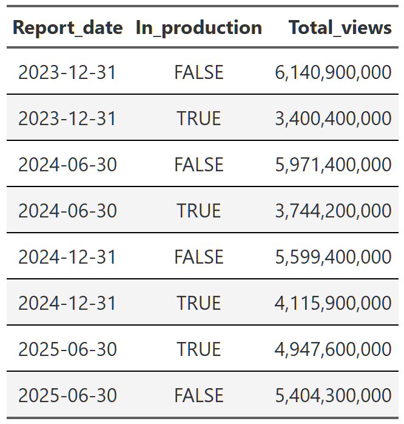{#tbl-in-prod-shows .lightbox}

```{r, in_prod_shows}
in_prod_shows <- shows_cleaned |> 
  ungroup() |> 
  group_by(series) |> 
  mutate(in_production = any(startsWith(new_release, 'New'))) |>  
  ungroup() |> 
  summarise(total_views = sum(views, na.rm = TRUE), .by = c(report_date, in_production)) |> 
  arrange(report_date) |> 
  gt() |> 
  format_table_header() |> 
  fmt_number(columns = total_views,
             rows = everything(),
             decimals = 0) |> 
  format_table_style()

# gtsave(in_prod_shows, "in_prod_shows.png")  
```

#### Popular Shows With New Seasons

Looking at some series that are popular right now we have @tbl-total-views-popular-shows.

```{r, total_views_popular_shows_new_seasons}
total_views_popular_shows <- shows_cleaned |> 
  filter(startsWith(title, 'Bridgerton: Season')|
           startsWith(title, 'Squid Game: Season')|series %in% c("3 Body Problem", 'Emily in Paris', 'Virgin River', 'Lupin')) |>  
  calc_table_data(series, report_date, summary_func = sum) |> 
  build_formatted_table(add_conditional_highlights = TRUE, series, report_date)

# gtsave(total_views_popular_shows, "total_views_popular_shows.png")
```

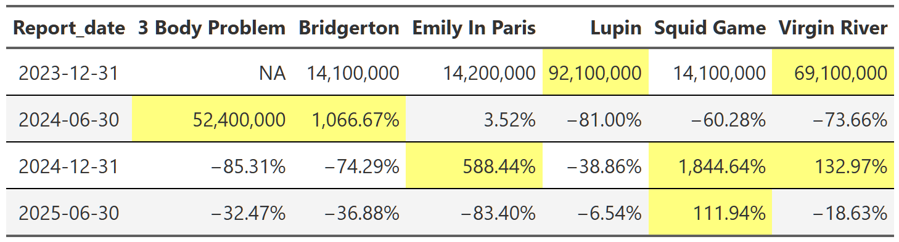{#tbl-total-views-popular-shows .lightbox}

Cells in yellow indicate that the show released a new season during that report. As you can see from the table, these shows have explosive view growth when a new season releases. One of the most popular and talked about series right now is Bridgerton. Its total views increased by over 1,000% in 2024 when the third season premiered! All these shows are perfect examples of what we uncovered in the overall section before: new seasons spike views immensely during the reporting period they're released, but that spike is followed by precipitous declines the following report. This makes sense as people watch and then move on to the next new show capturing public attention, but it's still interesting to see how pronounced the effect is at the individual show level.

The most interesting data point in @tbl-total-views-popular-shows is probably the Squid Game column. You can see that it exhibits the typical explosive growth expected when a popular series releases a new season, but even for these shows \~1,800% is high. And how does it manage to maintain over 100% growth the following report as well? Well, not to get too into the weeds here, but this is for two reasons. One, Squid Game is one of the few(only?) shows to release a new season in back-to-back reports--the second half of 2024 and the first half of 2025. This means it gets a kind of double jump increase in views during those reports. Secondly, the release timing of the new Squid Game seasons reveals a limitation of the way this analysis is done. The second and third seasons of Squid Game released five and three days before the end of their report periods respectively. This means that a huge chunk of their lift views are actually in the following report, not the report in which they were released. There is not a lot I can do aside from acknowledging this, but the effect is that season two's lift is distributed over two report periods instead of one. The same goes for season three, but I don't have that data yet so I can't say what the numbers are. The combination of these two factors results in this unusual extended view lift across two reports. 

This straddling effect is present throughout the dataset, but it isn't really a flaw of the analysis, it's just a feature of the dataset that the analysis revealed. I think a likely explanation for the straddling is that the release timing of seasons near the end of of reports is a strategic move by Netflix. By releasing popular series' straddled over two reports, they are able to show increased view numbers to shareholders over two periods instead of one. Of course I'm just speculating, but this seems like a very deliberate strategy to maximize views(and thus subscriber retention) through strategic release timings of new content.

#### Specific Show View Trajectories

To finish up this post, I want to quickly look at a selection of shows to track their seasonal views across reports.

```{r, specific_shows_seasonal}
breaking_bad_season <- shows_cleaned |> 
  filter(series %in% c("Breaking Bad")) |> 
  calc_table_data(season, report_date, summary_func = sum) |> 
  build_formatted_table(add_conditional_highlights = TRUE, season, report_date)

suits_season <- shows_cleaned |> 
  filter(startsWith(series,"Suits")) |> 
  calc_table_data(season, report_date, summary_func = sum) |> 
  build_formatted_table(add_conditional_highlights = TRUE, season, report_date)

stranger_things_season <- shows_cleaned |> 
  filter(series %in% c("Stranger Things")) |> 
  calc_table_data(season, report_date, summary_func = sum) |> 
  build_formatted_table(add_conditional_highlights = TRUE, season, report_date)

# gtsave(breaking_bad_season, "breaking_bad_season.png")
# gtsave(suits_season, "suits_season.png")
# gtsave(stranger_things_season, "stranger_things_season.png")
```

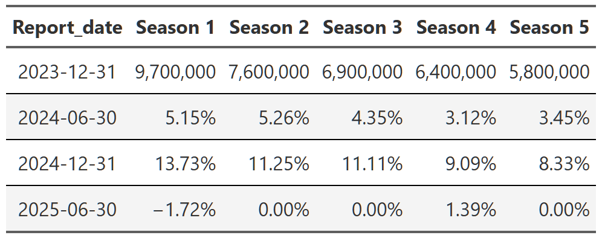{#tbl-breaking-bad-seasonal .lightbox}

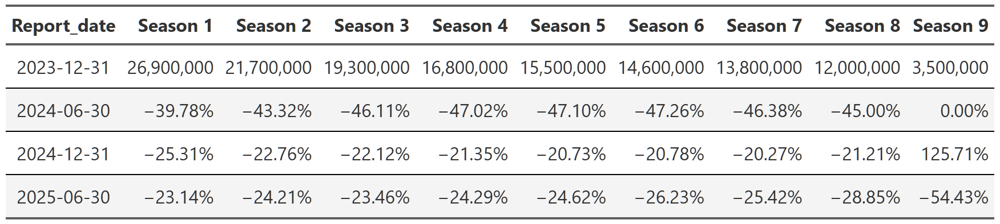{#tbl-suits-seasonal .lightbox}

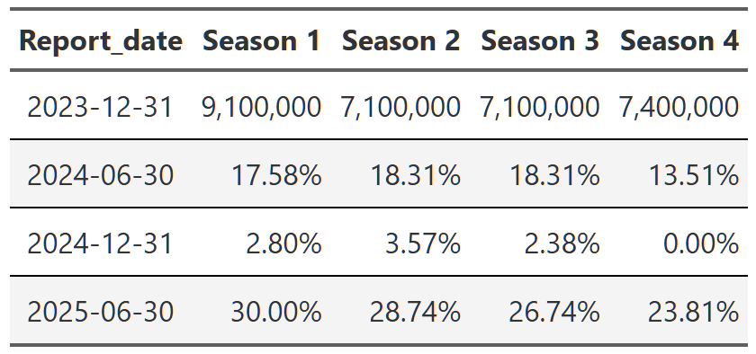{#tbl-stranger-things-seasonal .lightbox}

@tbl-breaking-bad-seasonal, @tbl-suits-seasonal, and @tbl-stranger-things-seasonal show the trajectory of views of Breaking Bad, Suits and Stranger Things respectively. You can see that within each show, the trajectory is quite consistent across the reports. Breaking Bad's views decline from season 1 to season 5, but within each season the pattern is consistent--views go up a little in the second report, up a bit more in the third and then are more or less flat in the 2025 report. Remember, each percent is the change from the previous report. That means with Suits, we see season 1 views drop \~40% in the first 2024 report, then another \~25% in the second half of 2024 and finally another \~23% in 2025. So we again get the \~65% drop in views from the first to the last report, but this time we can see it's happening consistently within each season too.

It's worth noting that you can also swap this order and display the reports as your headers and then look at the change from season to season. It's easier to see the progression of views from season to season that way(e.g. Season 1 got 9.7 million views, then season 2 got 21% fewer than season 1, season 3 got 9% fewer than season 2, etc), but I don't think either presentation is the superior method so I just chose the one I found more interesting. The alternative tables are in the footnotes[^13][^14][^15].

[^13]: 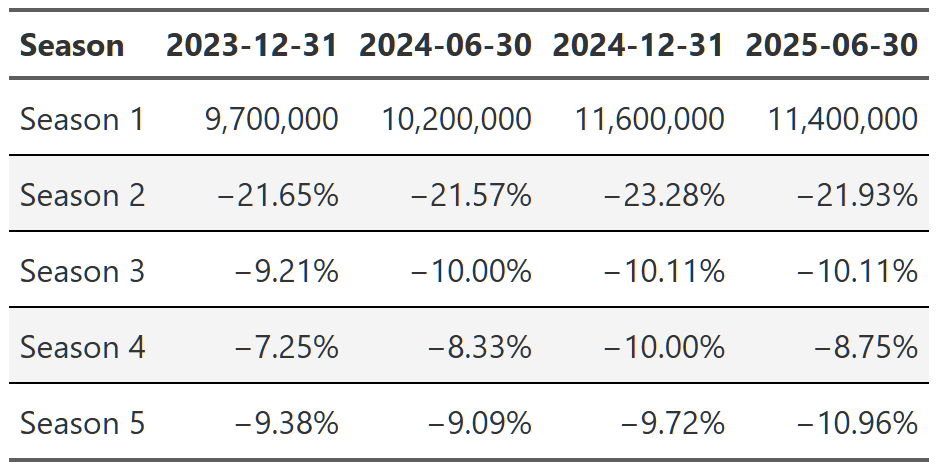{#tbl-breaking-bad-alt .lightbox}

[^14]: 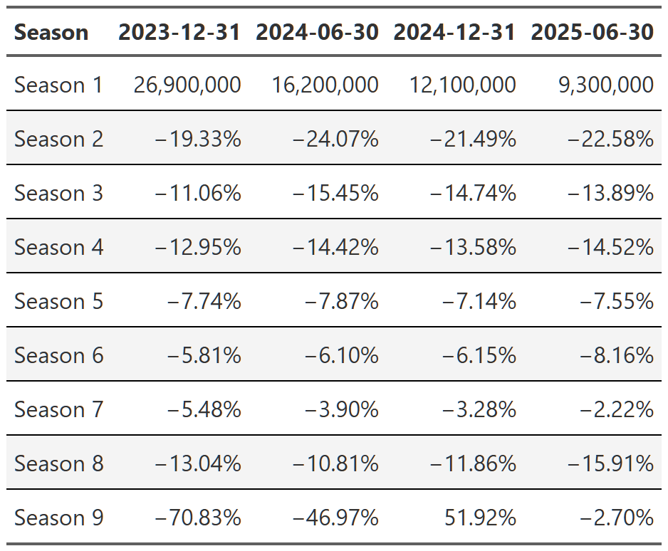{#tbl-suits-alt .lightbox}

[^15]: 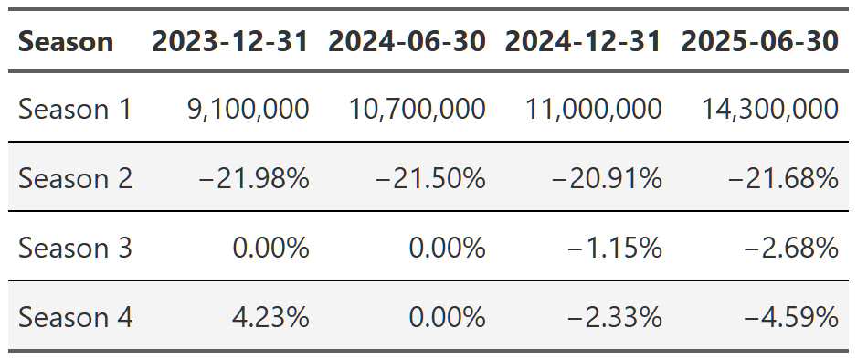{#tbl-stranger-things-alt .lightbox}

    ```{r, specific_shows_seasonal_alt}
    breaking_bad_alt <- shows_cleaned |> 
      filter(series %in% c("Breaking Bad")) |> 
      calc_table_data(report_date, season, summary_func = sum) |> 
      build_formatted_table(add_conditional_highlights = TRUE, report_date, season)

    suits_alt <- shows_cleaned |> 
      filter(startsWith(series,"Suits")) |> 
      calc_table_data(report_date, season, summary_func = sum) |> 
      build_formatted_table(add_conditional_highlights = TRUE, report_date, season)

    stranger_things_alt <- shows_cleaned |> 
      filter(series %in% c("Stranger Things")) |> 
      calc_table_data(report_date, season, summary_func = sum) |> 
      build_formatted_table(add_conditional_highlights = TRUE, report_date, season)

    # gtsave(breaking_bad_alt, "breaking_bad_alt.png")
    # gtsave(suits_alt, "suits_alt.png")
    # gtsave(stranger_things_alt, "stranger_things_alt.png")
    ```

Finally, we can examine a couple of the popular shows that had new seasons.

```{r, popular_shows_lift}
virgin_river <- shows_cleaned |> 
  filter(series %in% c("Virgin River")) |> 
  calc_table_data(season, report_date, summary_func = sum) |> 
  build_formatted_table(add_conditional_highlights = TRUE, season, report_date)

bridgerton <- shows_cleaned |> 
  filter(startsWith(title, "Bridgerton: Season")) |> 
  calc_table_data(season, report_date, summary_func = sum) |> 
  build_formatted_table(add_conditional_highlights = TRUE, season, report_date)

squid_game <- shows_cleaned |> 
  filter(startsWith(title, "Squid Game: Season")) |> 
  calc_table_data(season, report_date, summary_func = sum) |> 
  build_formatted_table(add_conditional_highlights = TRUE, season, report_date)

# gtsave(virgin_river, "virgin_river.png")
# gtsave(bridgerton, "bridgerton.png")
# gtsave(squid_game, "squid_game.png")
```

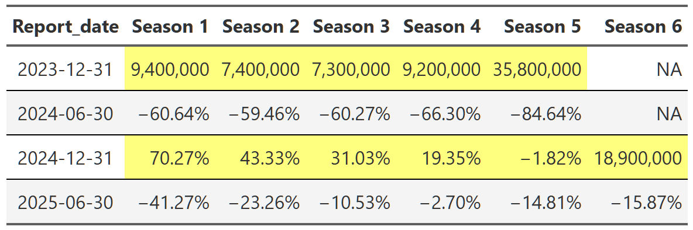{#tbl-virgin-river .lightbox}

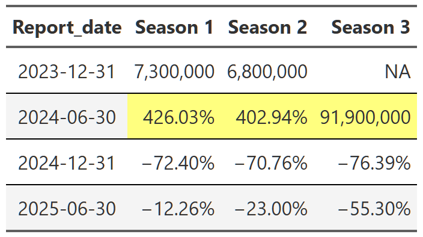{#tbl-bridgerton .lightbox}

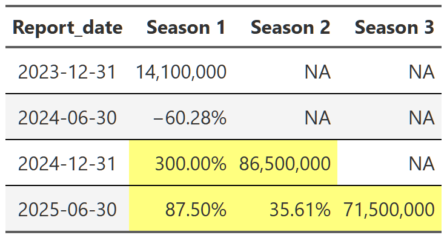{#tbl-squid-game .lightbox}

@tbl-virgin-river, @tbl-bridgerton, and @tbl-squid-game show the lift effect of Virgin River, Bridgerton and Squid Game respectively. I think this is a beautiful way to illustrate how a new season pulls up all those older seasons when it releases. For example, in @tbl-bridgerton we see that the release of the third season of Bridgerton increased the views of the first and second season by over 400% each. That's really useful information. And so is the fact that in the next report, all three seasons drop 70% off that peak. These tables are a nice easy way to display this information since I really don't care about the exact number of views. I just want to see what the lift is and so honing in on the comparison to the last report for each season is precisely what I need. One final point, notice we can also see the back-to-back new season releases in @tbl-squid-game. While Bridgerton suffered your typical decline in views after a new release, Squid Game avoided that in the 2025 report by just continuing to release new seasons. Why don't all shows just constantly release new content!?

## Wrapping Up

Whew, this post covered a lot of ground. We started by creating some cumulative viewing plots of the Netflix viewing data to explore the breadth of subscriber viewing. There we found that roughly 75% of views are captured by \~1,300 shows. Even more astounding, \~100 shows capture \~25% of total views. We also examined whether this follows some sort of power law, but, ultimately, because of uncertainty around missing data and data rounding we couldn't say for sure either way.

Next, we moved on to examining overall and individual trends in viewing. Netflix views appear to be increasing overall and we can quantify the large effect of new releases on viewing of old seasons of shows. In the final section, we dug in to a selection of shows to really see how large of an effect new releases could have--Bridgerton and Squid Game both experienced over 1,000% view bumps from new seasons! Ultimately, the Netflix library is a balancing act though, and while new releases probably drive a good portion of subscriptions, we also noticed that new-to-Netflix or older/syndication type shows make up a majority of the viewing on the platform and probably play a critical role in subscriber retention over time.

Overall, I had a ton of fun with this analysis. As usual, there was so much more I looked at and that would be fun to explore further, but I've got to draw the line somewhere! I think a great extension of this project would be to sketch out a Shiny app where you could easily examine the show level data for any show in the dataset. I also think developing some method for examining individual trajectory compared to the average to systematically identify over/under performing shows could be an interesting area for more analysis. I may try to knock those out in the future, but only time will tell.

One final note: you should take everything in this with a grain of salt. This isn't the definitive source for Netflix viewing information. There are several ways where my analysis is, at best, leaky, either because of realities with the limitations of the source data(it was great, I'm not complaining) or because of the hackish ways I worked out to categorize things. I for the most part tried to point out when I was doing something in a suspect way, but there are inevitably other instances I didn't mention. Them's the realities of data work and, despite these caveats, I stand by the conclusions I've drawn here. However, if you notice anything too out of whack, feel free to email me and discuss!

Until next time!

