```{r package_load, echo=FALSE}
#| message: false
#| warning: false

library(tidyverse)
library(duckdb)
library(duckplyr)
# nice tables
library(gt)
# composable plots
library(patchwork)
# text annotation on line graphs
library(ggrepel)
# nice color palettes
library(ggsci)
# highlighting specific lines in a plot
library(gghighlight)
library(shadowtext)
# model deployment
library(vetiver)
library(plumber)
library(pins)
# various helper functions
source("helper_functions.R")
```

One of my favorite public goods has always been the library. Going all the way back to elementary school and the glorious pan-pizza summer reading challenges, I always found it magical you could go to this place and have the world of books at your fingertips. And those stacks of books weren't just endless, they were *free*! All that was asked was that you brought them back after you were done, so that someone else could enjoy them! Needless to say, I have had a soft spot for libraries most of my life.

After discovering that I was a data nerd, one of the first things I thought about exploring was library data. Imagine the things you could learn! At that time though, I couldn't find any good library data sources, so the idea went on the back shelf where it has been gathering dust ever since. Well friends, no longer! A couple months ago I discovered that the Seattle Public Library has a portal where you can access checkout data. There is a [monthly aggregation](https://data.seattle.gov/Community-and-Culture/Checkouts-by-Title/tmmm-ytt6/about_data) dataset, a [dataset of all the physical item checkouts](https://data.seattle.gov/Community-and-Culture/Checkouts-By-Title-Physical-Items-/5src-czff/about_data) and even a [library inventory](https://data.seattle.gov/Community-and-Culture/Library-Collection-Inventory/6vkj-f5xf/about_data) dataset, and they go back all the way to 2005!

At \~50m, \~120m and \~144m rows, these datasets are huge and there are a whole host of interesting avenues to traverse and questions to ask and answer. Having already peeked at the datasets, I know I'm going to focus on the monthly aggregation data, but I think there are some really interesting opportunities with the others, especially the inventory dataset. For now, I want to do a fun little EDA and then I'm going to build a model to predict the number of monthly checkouts of a book. Let's go ahead and dive in!

# What the Heck Does This Data Set Look Like?

First things first, I want to get a sense of what is in the dataset. Since I got this from the portal as a huge csv file, I'm going to use duckdb to ease the exploration, but I'll still need to be pretty careful with the sorts of queries I'm doing if I don't want to wait all day.[^1] Duckdb makes the data ingestion pretty easy and I just make a local duckdb instance and import the csv file into a local database. The default parsing with duckdb_read_csv fails because there are some weird character values in the ID variable, but specifying the variable types manually takes care of those issues.

[^1]: It is surprisingly easy to, *cough*, accidentally generate a tibble with 300+ million rows.

```{r data_import, echo = TRUE, eval = FALSE}
#Connect to local duckdb
con <- dbConnect(duckdb(), dbdir = "duckdb_monthly", read_only = FALSE)
# initial reading of the csv file. Have to manually specify types because ID
# randomly(?) has a couple values with characters in it
# duckdb_read_csv(con, "checkouts_monthly", "/Users/USERNAME/Downloads/Checkouts_by_Title_20250813.csv",
#                 col.types = c(
#                   UsageClass = "VARCHAR",
#                   CheckoutType = "VARCHAR",
#                   MaterialType = "VARCHAR",
#                   CheckoutYear = "BIGINT",
#                   CheckoutMonth = "BIGINT",
#                   Checkouts = "BIGINT",
#                   Title = "VARCHAR",
#                   ISBN = "VARCHAR",
#                   Creator = "VARCHAR",
#                   Subjects = "VARCHAR",
#                   Publisher = "VARCHAR",
#                   PublicationYear = "VARCHAR"
#                 ))

#connect to the database instances and create a table to work with
monthly_checkouts <- tbl(con, 'checkouts_monthly')
```

## Variable Exploration

With the data loaded and a connection established, I can take a look at the variables in the dataset. Using the [data](https://data.seattle.gov/Community-and-Culture/Checkouts-by-Title/tmmm-ytt6/about_data) dictionary and a list of variables, I see that that data set has everything from usage class--ie whether an item is a physical book or a digital one-- to the material type of the item, the subjects, etc.

```{r dataset_variables, eval = TRUE}
# example_data <- monthly_checkouts |> 
#   head(100) |> 
#   collect()

# pins::pin_write(board, example_data, title = 'Snippet of full data for displaying')
# access to my pins of data and models
board <- board_folder(path =here::here('posts', 'seattle-library-analysis', 'data/final'), versioned = TRUE)
pins::pin_read(board, 'example_data') |> names()
```

A common first step in EDA for me is to get a bunch of counts of important sounding variables to get a general sense of the scope and variation of said variables. Since I'm doing this several times, I'll wrap that logic in a quick little function.

```{r exploratory_counts, eval = FALSE}
quick_counts <- function(.data, count_var){
  #.data should be a tbl db connection
  .data |> 
    #make nice snake_case variable names
    janitor::clean_names() |> 
    count({{count_var}}) |> 
    arrange(desc(n)) |> 
    collect()
}

usage_class_counts <- quick_counts(monthly_checkouts, usage_class) 
material_type_counts <- quick_counts(monthly_checkouts, material_type) |> head(21)
checkout_year_counts <- quick_counts(monthly_checkouts, checkout_year) |>  as_tibble()
publisher_counts <- quick_counts(monthly_checkouts, publisher) |> head(21)
total_checkouts <- monthly_checkouts |> 
  janitor::clean_names() |>   
  summarise(total_checkouts = sum(checkouts)) |> 
  collect()


counts_1 <- wrap_table(publisher_counts |> 
             gt() |> 
             format_table_header() |> 
             format_table_numbers() |> 
             cols_label(n = "Total")) + 
  wrap_table(material_type_counts |>
               gt() |>
               format_table_header() |> 
               format_table_numbers()|> 
              cols_label(n = "Total")) + 
  wrap_table(checkout_year_counts |>
               gt() |> 
               data_color(
                 columns = c(checkout_year, n),
                 rows = n < 1700000, 
                 palette = 'yellow'
               ) |> 
               format_table_header() |> 
               format_table_numbers()|> 
              cols_label(n = "Total")) 

ggsave('counts_plot.png', counts_1, height = 6.5)

```

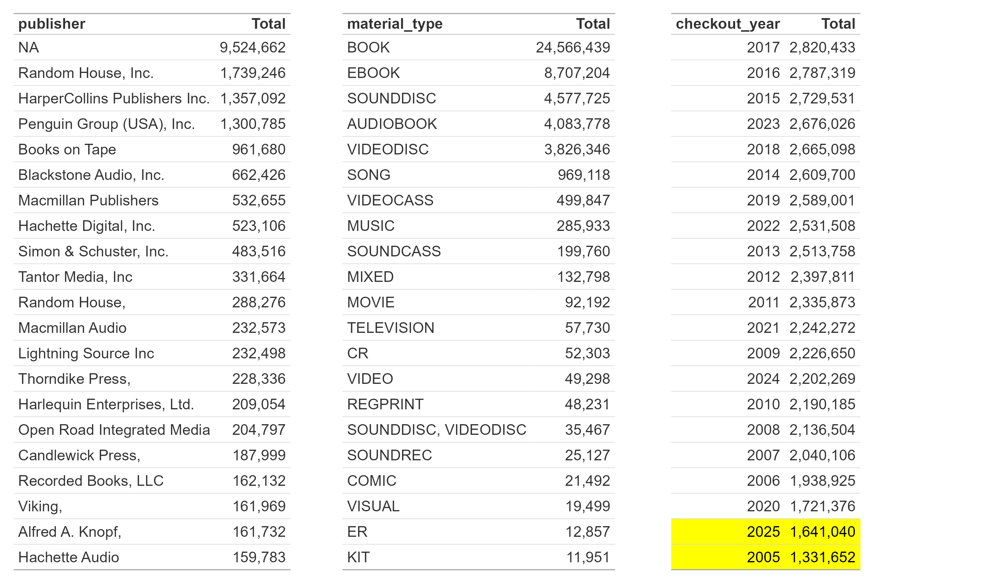{#tbl-one .lightbox}

@tbl-one's contents are a little ambiguous at first. Remember, I am working with monthly aggregations, so when the publisher table says Random House, Inc. had a total of 1,739,246, what exactly does that mean? That is the number of rows in the data set where Random House, Inc was the publisher of the checked out book--and each of those rows contains a count of the number of checkouts of a specific item for that specific year and month. All three of the tables in @tbl-one follow that format. The main thing I see from this is that there are a lot of potential NA values and there are a lot of different items that the library lends. Books and ebooks are pretty obvious, but a lot of people don't realize how much music and video content the library lends out. @tbl-one also highlights that 2025 and 2005 are especially low on checkouts totals. Why? Well, they are incomplete years. The dataset starts in April 2005 and ends in July of 2025. This is just something to keep in mind during analysis.

@tbl-two shows the amount of physical vs digital checkouts--physical outnumbers digital almost 3 to 1. Remember, this means that there are 3 times more physical items represented in the data set--it doesn't necessarily mean that there were 3 times as many checkouts of physical items versus digital ones. After all, the checkout counts for each of the physical rows could be 1 and the digital rows could be 100! The total_checkouts table *does* show the actual volume of checkouts and it's pretty staggering. The Seattle library system, from April 2005 to July 2025, lent over 167 million items(and over 114 million books)! With some napkin math and Wikipedia population numbers, that works out to something like every person in the city checking out \~10 items per year. That's a whole lot of knowledge shared with the city.

```{r item-counts, eval = FALSE}
counts_2 <- wrap_table(usage_class_counts |> 
             gt() |>  
             format_table_header() |> 
             format_table_numbers() |> 
             cols_label(n = 'Total'))+
  wrap_table(total_checkouts |> 
               gt() |>  
               format_table_header() |> 
               fmt_number(decimals = 0))

# ggsave('item_counts_plot.png', counts_2, height = 1, width = 5)
```

{#tbl-two .lightbox}

# What Are We Interested in Exploring in This Dataset?

Since I know this dataset is so broad and deep, I'm going to immediately make the executive decision to focus on just books. There are surely equally interesting lines of discovery in movies, music, etc, but I have to draw the line somewhere and books are definitely what most people think of when they picture a library! I want to answer three, somewhat amorphous, questions in this exploratory analysis.

1.  How much are people reading?
2.  What are people reading?
3.  Are people reading a narrower subset of books than they used to?

```{r my_plot_theme, include = FALSE}
my_plot_theme <- function(base_family="Karla", 
                          base_size =12,
                          plot_title_family='Karla',
                          plot_title_size = 20,
                          grid_col='#dadada') { 
  aplot <- ggplot2::theme_minimal(base_family=base_family, base_size=base_size) #piggyback on theme_minimal 
  aplot <- aplot + theme(panel.grid=element_line(color=grid_col))
  aplot <- aplot + theme(plot.title=element_text(size=plot_title_size, 
                                                 family=plot_title_family))
  aplot <- aplot + theme(axis.ticks = element_blank())
  aplot
}

#generic line plot tweaks for most/all line plots this post
line_plot_tweaks <- function(x_is_date = FALSE) {
  alist <- list(
    scale_y_continuous(labels = scales::number_format(big.mark = ',')),
    expand_limits(y = 0), 
    scale_color_aaas()
    )
  #default is x-axis not being a date
  if(x_is_date){
    alist <- c(alist, scale_x_date(minor_breaks = 'year'))
  }
  alist
}
 
 
```

## How Much are People Reading These Days?

A decent first stab at the '*how much*' question is to base it on total checkouts per month-so how many digital or physical books were checked out each month. If the library is lending out 100,000 books a month, I'm going to assume that means people are *reading* 100,000 books a month. That is a pretty shaky assumption, but I'm going to make it. Since the data set comes in this monthly checkout format, I can pretty much dive right in.

### Total Checkouts Per Month

I want to start by looking at the total monthly checkouts of books over time, regardless of book type.

```{r total_book_checkouts_per_month, eval = FALSE}
# total_checkouts_by_month <- monthly_checkouts |> 
#   janitor::clean_names() |> 
#   filter_by_condition(material_type %in% c('EBOOK', 'AUDIOBOOK', 'BOOK')) |> 
#   group_by(checkout_year, checkout_month) |> 
#   summarise(monthly_checkouts = sum(checkouts, na.rm = TRUE)) |> 
#   collect() |> 
#   mutate(year_month = as.Date(tsibble::yearmonth(paste0(checkout_year, " ", checkout_month)),
#                               "%Y %m"))

# save this data for use in blog post to avoid having to use database connection
# board |> pin_write(name = 'plot_data', x = total_checkouts_by_month, versioned = TRUE)

# load saved data
total_checkouts_by_month <- board |> 
  pin_read('plot_data', version = '20250926T182301Z-c7f05')

p <- total_checkouts_by_month |> 
  ggplot(aes(x = year_month, y = monthly_checkouts))+
  geom_line(linewidth = .6)+
  geom_smooth(method = 'lm', se = FALSE, color = '#008B45FF', linewidth = .5)+
  labs(
    x = NULL,
    y = NULL,
    title = 'How many books are checked out each month?',
    subtitle = 'Includes physical books, ebooks and audiobooks'
  )+
  annotate(geom = 'point', x = as.Date('2020-03-23'), y = 360000, size = 8, shape = 21,
           fill = 'transparent', color = '#BB0021FF')+
  annotate(geom = 'text', x = as.Date('2018-03-01'), y = 360000,
           label = 'March 2020, \nCOVID lockdowns begin')+
  annotate(geom = 'point', x = as.Date('2024-06-15'), y = 510000, size = 8, shape = 21,
           fill = 'transparent', color = '#BB0021FF')+
  annotate(geom = 'text', x = as.Date('2023-01-01'), y = 475000,
           label = 'Seattle Library Under \n Ransomware Attack')+
  my_plot_theme()+
  line_plot_tweaks(x_is_date = TRUE)


# ggsave('total_book_checkouts_plot.png', plot = p, bg = 'white')
```

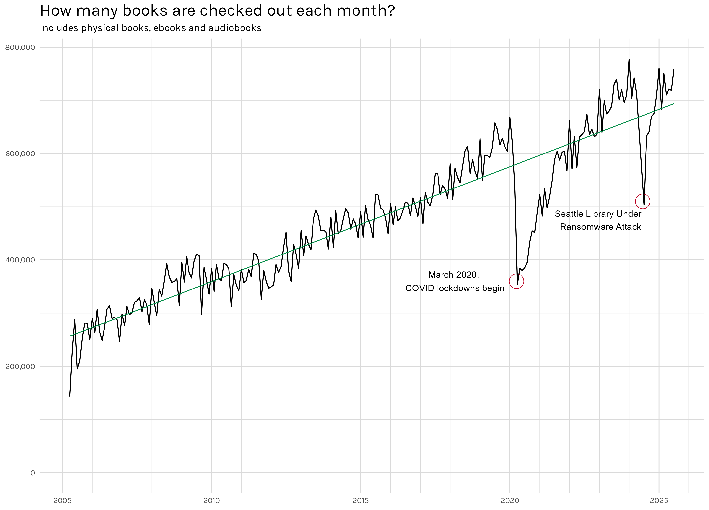{#fig-one width="100%" .lightbox}

Somewhat surprisingly, at least to me, @fig-one shows a strong upward trend. I would have guessed that fewer people were renting books from the library, but alas, I was wrong. There are two interesting points that jump out. One is the now familiar COVID 'dip', but the other was a mystery to me--someone decidedly *not* from the west coast. After a little googling, it turns out Seattle's library system suffered a [ransomware attack](https://www.libraryjournal.com/story/seattle-public-library-recovering-from-ransomware-attack) in May 2024. It is hard to pin down exactly what services went down and how long they were affected, but the dataset is missing data from May to June of 2024, and it appears July was either partially affected or otherwise incomplete. Aside from those two major disruptions, checkouts keep steadily rising. Seattle's public library system now lends out over 700k books per month.

### Total Checkouts Per Month by Type

But we can do better than just a monthly aggregation, this dataset is much richer than that! What if I disaggregate the monthly totals into books, audiobooks and ebooks. Are all book rentals trending in the same direction?

```{r disaggregated_total_books_by_month, eval = FALSE}
# material_type_checkouts_by_month <- monthly_checkouts |> 
#   janitor::clean_names() |> 
#   filter_by_condition(material_type %in% c('EBOOK', 'AUDIOBOOK', 'BOOK')) |>
#   group_by(checkout_year, checkout_month, material_type) |> 
#   summarise(monthly_checkouts = sum(checkouts)) |> 
#   collect() |> 
#   mutate(year_month = as.Date(tsibble::yearmonth(paste0(checkout_year, " ", checkout_month)),
#                               "%Y %m"))
# # save data as pin
# board |> pin_write(name = 'plot_data', x = material_type_checkouts_by_month, versioned = TRUE)

material_type_checkouts_by_month <- board |> pin_read('plot_data', version = '20250926T194043Z-98e13')

#retrieve the last date to use to attach annotation to
get_end_labels <- function(df, filter_var){
  #takes a summarised df and returns a df filtered to just the last month
  df |> 
    ungroup() |> 
    filter({{filter_var}})
}


physical_book_pre_covid <- material_type_checkouts_by_month |> 
  filter_by_condition(material_type == 'BOOK', year_month <= '2020-02-01') |> 
  ungroup() |> 
  summarise(average = mean(monthly_checkouts))
  
physical_book_post_covid <- material_type_checkouts_by_month |> 
  filter_by_condition(material_type == 'BOOK', year_month > '2020-02-01') |> 
  ungroup() |> 
  summarise(average = mean(monthly_checkouts))

#get percentage increase in ebooks 
perc_increase <- material_type_checkouts_by_month |> 
  ungroup() |> 
  filter_by_condition(material_type == "EBOOK", year_month == '2020-01-01' | year_month == '2020-05-01') |>
  #make sure rows are in the correct order for calculating leads
  arrange(desc(year_month)) |> 
  mutate(perc_inc = (monthly_checkouts - lead(monthly_checkouts))/lead(monthly_checkouts) * 100)

p2 <- material_type_checkouts_by_month |> 
  ggplot(aes(x = year_month, y = monthly_checkouts, color = material_type))+
  geom_line(linewidth = .6)+
  geom_label(data = get_end_labels(material_type_checkouts_by_month, year_month == max(year_month)),
            aes(x = year_month, y = monthly_checkouts, label = material_type),
            hjust = -.2, fontface = 'bold', size = 3, family = 'Karla')+
  line_plot_tweaks(x_is_date = TRUE)+
  scale_x_date(limits = c(as.Date('2005-01-01'), as.Date('2027-01-01')),
               minor_breaks = 'year')+
  labs(
    x = NULL,
    y = NULL,
    title = 'Total monthly checkouts by book type',
    subtitle = 'How many e-books, audiobooks, and physical books did people rent?'
  )+
  geom_segment(data = physical_book_pre_covid, aes(x = as.Date('2005-01-01'),
                                             xend = as.Date('2020-02-01'),
                                             y = average), color = 'gray25',linetype = 'dashed')+
  geom_segment(data = physical_book_post_covid, aes(x = as.Date('2020-03-01'),
                                              xend = as.Date('2025-09-01'),
                                              y = average), color = 'gray25',
                                           linetype = 'dashed')+
  annotate(geom = 'text', x = as.Date('2005-07-01'), y = 325000,
           label = scales::label_number(big.mark = ',')(physical_book_pre_covid$average),
           size = 3, family = "Karla")+
  annotate(geom = 'text', x = as.Date('2025-07-01'), y = 190000,
           label = scales::label_number(big.mark = ',')(physical_book_post_covid$average),
           size = 3, family = "Karla")+
  annotate(geom = 'rect', xmin = as.Date('2019-06-01'),
           xmax = as.Date('2021-01-01'), ymin = 180000, ymax = 260000,
           alpha = .10, col = 'black')+
  annotate(geom = 'text', x = as.Date("2016-06-01"), y = 250000,
           label = glue::glue("{round(perc_increase$perc_inc[1], 0)}% increase in ebook rentals\n from Jan 2020 to May 2020"), family = "Karla")+
  my_plot_theme()+
  theme(
    legend.position = 'None'
  )
  
# ggsave('total_checkouts_by_type.png', p2, bg = 'white')
```

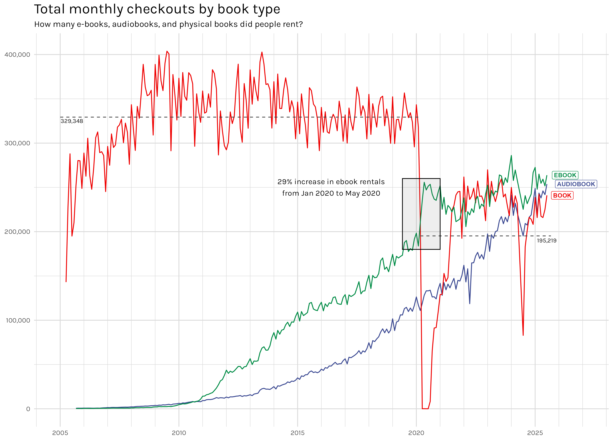{#fig-two width="100%" .lightbox}

Well, not exactly! @fig-two shows that physical book rentals were decimated by COVID. If I remember correctly, my local library stopped lending completely for the first couple months and even after that it was fairly limited. More confusing is why physical books haven't really recovered. You can see that the average number of physical books that are checked out(indicated by the gray dashed lines) is well over 100k lower than pre-pandemic.

```{r table_pre_post_pandemic_comparison, eval = FALSE, include = FALSE}
pre_post_covid_monthly_average_table <- material_type_checkouts_by_month |> 
  filter(checkout_year == 2019 | checkout_year == 2024) |>
  summarise(total_checkouts = sum(monthly_checkouts)) |> 
  group_by(checkout_year) |> 
  summarise(n = mean(total_checkouts)) |> 
  gt() |> 
  format_table_header() |> 
  format_table_numbers() |> 
  cols_label(n = 'Average Monthly Checkouts')


gtsave(pre_post_covid_monthly_average_table, 'pre_post_covid_monthly_average_table.png')
```

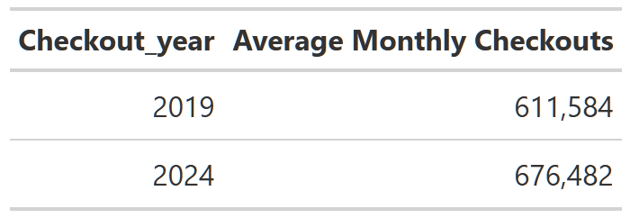{#tbl-three .lightbox}

But if you look at the average *total* monthly checkouts from 2019 vs 2024 in @tbl-three, you clearly see that *more* total books are being checked out. We saw this already in @fig-one, but we can see why in @fig-two. What appears to have happened is that the COVID dip in physical checkouts coincided with a nearly 30% increase in ebook rentals. That '*temporary*' bump in ebook adoption has not been temporary at all and as you can see in @fig-two, ebooks(and audiobooks) are both checked out more often that physical books these days. In the last 15 years, ebook checkouts have increased by roughly 6000%! So physical book checkouts are down(\~-40-50%), but overall, Seattle is lending out more books than ever because digital book checkouts have more than picked up the slack.

### Total Checkouts Digital Versus Physical

Since the physical/digital checkout shift is so stark, I wanted a better look at it. @fig-three shows that the pandemic served as a sort of paradigm shift. Digital checkouts had been growing for nearly a decade, but the inaccessibility of physical books during the COVID period seems to have nudged people to make the digital swap. Physical book checkouts appear to have stabilized at a level roughly 40-50% lower than pre-pandemic, while digital checkouts have continued their upward trend.

```{r digital_v_physical_rentals, eval = FALSE}
# usage_class_monthly <- monthly_checkouts |> 
#   janitor::clean_names() |> 
#   filter_by_condition(material_type %in% c('EBOOK', 'AUDIOBOOK', 'BOOK')) |> 
#   group_by(checkout_year, checkout_month, usage_class) |> 
#   summarise(monthly_checkouts = sum(checkouts)) |> 
#   collect() |> 
#   mutate(year_month = as.Date(tsibble::yearmonth(paste0(checkout_year, ' ', checkout_month), "%Y %m")))
# 
# board |> pin_write('plot_data', x = usage_class_monthly, versioned = TRUE)

usage_class_monthly <- board |> 
  pin_read('plot_data', version = '20250926T200549Z-a0af2')

p3 <- usage_class_monthly |> 
  ggplot(aes(x = year_month, y = monthly_checkouts, color = usage_class))+
  geom_line(linewidth = .6)+
  geom_label(data = get_end_labels(usage_class_monthly , year_month == max(year_month)),
            aes(x = year_month, y = monthly_checkouts, label = usage_class),
            hjust = -.2, fontface = 'bold', size = 3, family = 'Karla')+
  labs(
    x = NULL,
    y = NULL, 
    title = "Digital vs physical checkouts by month",
    subtitle = "Digital checkouts are now significantly more common than physical checkouts."
  )+
  line_plot_tweaks(x_is_date = TRUE)+
  scale_x_date(limits = c(as.Date('2005-01-01'), as.Date('2027-01-01')),
               minor_breaks = 'year')+
  my_plot_theme()+
  theme(
    legend.position = "None"
  )

# ggsave('digital_v_physical_monthly_checkouts.png', p3, bg = 'white')
```

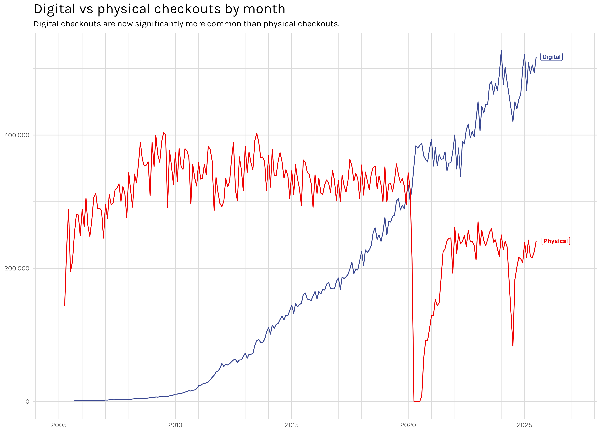{#fig-three width="100%" .lightbox}

### Growth of Digital Monthly Checkouts

So we know that digital checkouts are growing, but what does that growth look like? One common way to think about growth is to look at the month-over-month change. For each of our mediums, I can calculate the percent change in checkouts from month-to-month with some lag calculations(simply the current months checkouts versus the last months) and that will give me the data I need to plot monthly changes.

```{r month_to_month_percent_change_functions, eval = FALSE}
# generates a month_over_month percent change df from a material type summarised df
month_over_month_percent_change_df <- function(df, filter_var){
  # validate df input
  stopifnot(is.data.frame(df))

  df |> 
    ungroup() |> 
    filter_by_condition({{filter_var}}) |> 
    group_by(material_type) |> 
    arrange(year_month) |> 
    mutate(monthly_change = round((monthly_checkouts - lag(monthly_checkouts))/lag(monthly_checkouts), 2))
}

# calculates a median value for a given percent change df
calculate_median_monthly_change <- function(perc_change_df){
  perc_change_df |> 
    summarise(median_monthly_change = median(monthly_change, na.rm = TRUE))
}

# generates a line plot of monthly percent change in # of checkouts
plot_monthly_change <- function(df1, median_df, adj_fact = 0, use_facet = TRUE,
                                .title = NULL, .subtitle = NULL, label_x = NULL, label_y = NULL,
                                adjust_color = FALSE, .color = NULL){
  #validate for data frames
  stopifnot(is.data.frame(df1))
  stopifnot(is.data.frame(median_df))
  
  
  #month_over_month changes df
  plot <- df1 |> 
    ggplot(aes(x = year_month, y = monthly_change, color = material_type))+
    geom_line()+
    #hline and text use data from the median_df 
    geom_hline(data = median_df, aes(yintercept = median_monthly_change),
             color = 'black', linetype = 'dashed')+
    geom_text(data = median_df, 
            aes(label = scales::label_percent()(median_monthly_change),
                x = as.Date("2005-01-01"),
                y = median_monthly_change + (median_monthly_change * adj_fact)),
            color = 'black', family = 'Karla', size = 3.5, nudge_x = -100)
  #make use of facets if specified
  if(use_facet){
    plot <- plot +
      facet_wrap(~material_type, scales = 'free_y')
  }
  
  #standard formatting to keep post plots consistent
  plot <- plot +
      my_plot_theme()+
      line_plot_tweaks(x_is_date = TRUE)+
      theme(
      legend.position = 'None'
    )+
    labs(
      x = label_x,
      y = label_y,
      title = .title,
      subtitle = .subtitle
      
    )+
    scale_y_continuous(label = scales::label_percent())
  
  #if adjusted_color toggled, manually change color to input color
  if(adjust_color){
    plot <- plot +
      scale_color_manual(values = .color)
  }
  plot
}

```

```{r month_to_month_percent_plots, eval = FALSE}
# build digital plots
month_to_month_percent_change_digital <- 
  month_over_month_percent_change_df(material_type_checkouts_by_month,
                                  material_type %in% c("EBOOK", "AUDIOBOOK")) 

digital_plots <- plot_monthly_change(df1 = month_to_month_percent_change_digital,
                    median_df = calculate_median_monthly_change(month_to_month_percent_change_digital),
                    adj_fact = 1, use_facet = TRUE,
                    label_y = "Monthly % Change",
                    .title = "Month over month % change in checkouts",
                    .subtitle = 'Ebook and audiobook usage continues to grow(slowly) month on month. Physical book % change is skewed by COVID,\n but when 2020 is removed, physical checkouts might still be in decline.')


# build physical plots
month_to_month_percent_change_physical <- 
  month_over_month_percent_change_df(material_type_checkouts_by_month,
                                     material_type == 'BOOK')

month_to_month_percent_change_physical_no_2020 <- 
  month_over_month_percent_change_df(material_type_checkouts_by_month,
                                     material_type == 'BOOK') |> 
  filter_by_condition(checkout_year != 2020)

physical_plot <- plot_monthly_change(df1 = month_to_month_percent_change_physical,
                    median_df = calculate_median_monthly_change(month_to_month_percent_change_physical),
                    adj_fact = -500, use_facet = TRUE, adjust_color = TRUE,
                    label_y = "Monthly % Change",
                    .color = '#008B45FF')

physical_no_2020_plot <- plot_monthly_change(df1 = month_to_month_percent_change_physical_no_2020,
                    median_df = calculate_median_monthly_change(month_to_month_percent_change_physical_no_2020),
                    label_y = NULL,
                    adj_fact = -5, use_facet = TRUE, adjust_color = TRUE,
                    .color = "#008B45FF")

month_over_month_change_plots <- digital_plots / (physical_plot + physical_no_2020_plot)

# ggsave('month_over_month_change_plots.png', month_over_month_change_plots)

```

```{r median_monthly_changes_table, eval = FALSE}
median_monthly_changes_table <- material_type_checkouts_by_month |> 
  month_over_month_percent_change_df(material_type %in% c("EBOOK", "BOOK", "AUDIOBOOK")) |> 
  calculate_median_monthly_change() |> 
  gt() |> 
  format_table_numbers(is_percent = TRUE, n = 'median_monthly_change')

# gtsave(median_monthly_changes_table, 'median_monthly_changes_table.png')
```

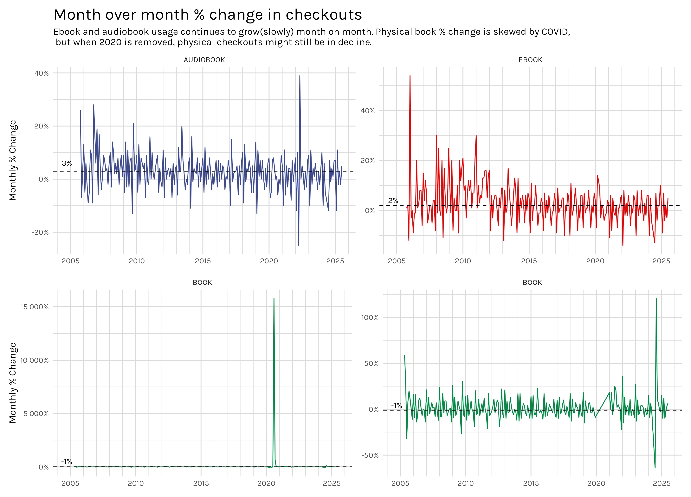{#fig-four width="100%" .lightbox}

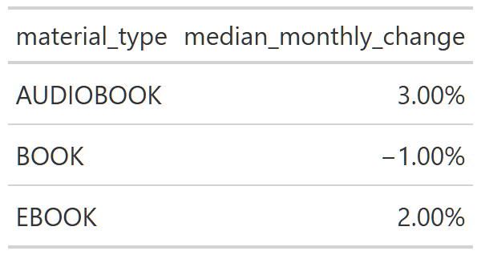{#tbl-four .lightbox}

Month over month, @fig-four shows ebooks and audiobooks growing at roughly 2-3%. There is slight drop, \~-1%, in physical books. Initially, I thought this was still related to some sort of COVID effect, but even when you look at only 2005-2019 physical book data, the -1% monthly change is still there. So physical books checkouts *are* quite stable, but they are also declining. Whether that trend continues remains to be seen.

It's also clear from @fig-four that, while all types of checkouts vary a lot from month to month, the digital mediums are clearly centered above 0, while physical books essentially look like they are randomly fluctuating around 0. It is a subtle difference, but 3% growth a month versus no growth is a large difference when magnified by time. If you started with 10 ebook checkouts in month 1 and checkouts grew at 3% a month for 10 years, by year 10, you'd be lending out 337 ebooks. That is a \~3200% increase. I think it's fair to say that physical books aren't in danger of disappearing any time soon, but it definitely looks like, at least in shear volume, digital books reign supreme.

### A Look at Checkouts Over the Years

A final way I'll look at checkout amounts is by simply breaking the totals down year by year.

```{r yearly_checkout_variation, eval = FALSE}
total_checkouts_by_year <- material_type_checkouts_by_month |> 
  #group_by(material_type) |> 
  summarise(monthly_total = sum(monthly_checkouts)) |> 
  mutate(checkout_year = as.character(checkout_year)) |> 
  ggplot(aes(x = as.factor(checkout_month), y = monthly_total,  group = checkout_year, color = checkout_year))+
  geom_line()+
  gghighlight(checkout_year >= 2019, use_direct_label = TRUE,
              unhighlighted_params = list(color = alpha("grey85", 1)),
              calculate_per_facet = TRUE)+
  #facet_wrap(~material_type, scales = 'free_y')+
  theme(
    legend.position = 'None'
  )+
  scale_x_discrete(labels = month.abb)+
  scale_y_continuous(labels = scales::label_comma())+
  scale_color_aaas()+
  labs(
    x = NULL,
    y = "Total Checkouts",
    title = 'Total book checkouts, by year',
    subtitle = 'After a pandemic related dip, library checkouts rebounded and continue to grow year after year.'
  )+
  my_plot_theme()

# ggsave('total_checkouts_by_year.png', total_checkouts_by_year)
```

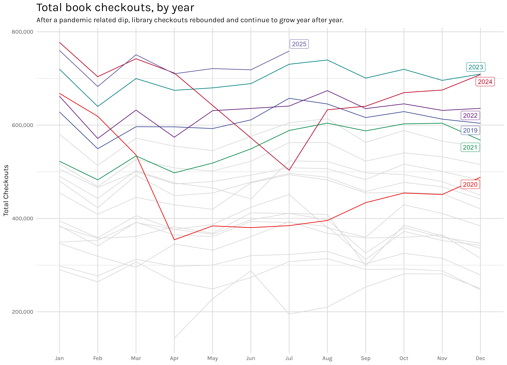{#fig-five width="100%" .lightbox}

@fig-five confirms what we saw in @fig-one--year after year more books are being checked out.[^2] It is also worth noting how little monthly variation there is in checkouts. I did look into this more closely, but there just was not that much there. I went into it thinking people probably read more in summer months and maybe during the winter(less outdoor activity, people often have time off, etc), but that was, if anything, weakly supported by the data, so I left out that rabbit hole.

[^2]: If it wasn't clear, the grey lines are all the years before 2019.

So what have we learned so far? Well, I cannot make any definitive statements, but Seattl-ites(?) are at the very least checking *out* more books than ever before, roughly \~700,000 a month! Again, I cannot say that people are reading more just because more books are checked out. For example, what if people are checking out more books from the library because they are *buying* fewer books? Or what if people are checking out more books because it is essentially zero cost to download an ebook or audiobook--if you do not finish it( or even start it), it does not matter because you never had to physically go pickup or return something. There are a whole host of reasons we cannot use this information to say people are reading more, but we can say that people are using the *library* more--at least for books. And that is good news in my book.

## What Do People Read?

My second question is simple--what the heck are people actually reading? Do people read more fiction or nonfiction? Are there specific subjects that are very popular? What about authors? Or maybe publishers? Luckily, a lot of these questions look like they can be answered with our dataset. Let's dive in!

### Most Popular Books Overall

First, what are the most popular books. For now I am going to bundle physical, ebook, and audiobooks together. Right away, the age old data science problem rears its head--data is messy. Specifically here, titles are messy! Books, ebooks and audiobooks often have slight variations in their titles. Different *versions* and different publications might also have slightly different titles. As an example, take a look at 'The Goldfinch'.

```{r base_top_25_df, eval = FALSE}
total_checkouts_by_title <- monthly_checkouts |> 
  select(-ISBN) |> 
  janitor::clean_names() |> 
  filter_by_condition(material_type %in% c("BOOK", "EBOOK", "AUDIOBOOK"), !if_any(everything(), is.na)) |> 
  group_by(title) |> 
  summarise(total = sum(checkouts, na.rm = TRUE)) |> 
  arrange(desc(total)) |> 
  collect()
  
# I don't want to deal will all million titles. I only want the top ones anyway
top_1000 <- total_checkouts_by_title |> 
  slice_head(n = 1000) |> 
  mutate(title = tolower(title))

goldfinch_table <- top_1000 |> 
  filter(grepl('the goldfinch.*', title)) |> 
  gt() |> 
  format_table_header()

gtsave(goldfinch_table, 'goldfinch_table.png')
```

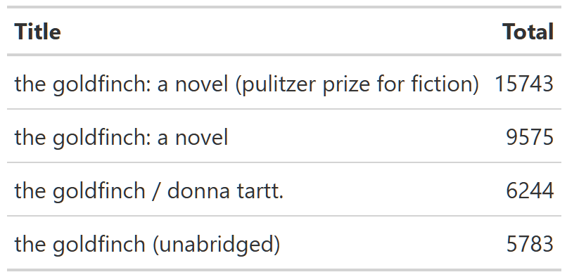{#tbl-five .lightbox}

This one book has 4 different titles! And these aren't variations with one or two counts. Ignoring them can halve(or more) the number of checkouts and makes the count of top books very inaccurate. Honestly, this is pretty annoying to deal with. My first thought was to do some fuzzymatching to group those titles together. This turned out to be very tricky, a little bit finicky, and really didn't work that well. Instead, I used tried and true regex to hack away at the titles and get them semi-grouped. This will *not* be a perfect solution, but it is good enough for my purposes here.

```{r tidy_titles, eval = FALSE}
#| code-fold: show
tidy_titles <- function(df){
  df |> 
    #lowercase titles
    mutate(title = tolower(title)) |> 
    # remove 'unabridged' from titles 
    mutate(title = str_trim(gsub("\\(unabridged\\)", "", title), side = 'both')) |> 
    # remove '/ (author)' from titles
    mutate(title = str_trim(gsub("\\/.*", "", title), side = 'both')) |> 
    # remove ': a novel' from titltes
    mutate(title = str_trim(gsub("\\: a novel.*", "", title), side = 'both')) |> 
    # trim the leading whitespace from :'s
    mutate(title = gsub(" \\:", ":", title))
}
```

After subsetting the top 1000 most checked out titles from the full monthly dataset, my tidy_title function pares that down to 789 unique titles. Like I said, the titles are messy! Now I can be more confident my counts will be correct and take a look at the top 25 titles.

```{r bar_plot_functions, eval = FALSE}
bar_plot_theme <- function(base_family="Karla", 
                          base_size =12,
                          plot_title_family='Karla',
                          plot_title_size = 20,
                          grid_col='#dadada') { 
  aplot <- ggplot2::theme_minimal(base_family=base_family, base_size=base_size) #piggyback on theme_minimal 
  aplot <- aplot + theme(panel.grid=element_line(color=grid_col))
  aplot <- aplot + theme(plot.title=element_text(size=plot_title_size, 
                                                 family=plot_title_family))
  aplot <- aplot + theme(axis.ticks = element_blank())
  aplot <- aplot + theme(axis.text.y = element_blank())
  aplot
}

make_bar_plot <- function(df, x_var, y_var, .plot_title = NULL, .plot_subtitle = NULL,
                                .x_nudge = NULL, adjust_y = FALSE,
                                filter_y_by = NULL, title_size = 20){
  x_var <- enquo(x_var)
  y_var <- enquo(y_var)
  
  plot <- ggplot(df) +
    geom_col(aes(x = !!x_var, y = fct_reorder(!!y_var, !!x_var)), fill = "#808180FF")+
    scale_x_continuous(expand = c(0, 0), labels = scales::label_comma())+
    labs(
      x = NULL,
      y = NULL,
      title = .plot_title,
      subtitle = .plot_subtitle
    )+
    bar_plot_theme(plot_title_size = title_size)
  
    if(adjust_y){
    plot <- 
      plot +
        geom_text(
          data = df |>  filter(!!x_var > filter_y_by),
          aes(x = 0, y = !!y_var, label = !!y_var),
          color = 'white',
          family = 'Karla',
          fontface = "bold",
          size = 3,
          hjust = 0,
          nudge_x = .x_nudge)+
        geom_shadowtext(
          data = df |>  filter(!!x_var < filter_y_by),
          aes(x = !!x_var, y = !!y_var, label = !!y_var),
          color = '#808180FF',
          family = 'Karla',
          fontface = "bold",
          size = 3,
          bg.color = 'white',
          hjust = 0,
          nudge_x = .x_nudge)
    
    } else {
      plot <- 
        plot + 
          geom_text(
            aes(x = 0, y = !!y_var, label = !!y_var),
            color = 'white',
            family = 'Karla',
            fontface = "bold",
            size = 3,
            hjust = 0,
            nudge_x = .x_nudge)
    }
      plot
}
```

```{r top_25_books, eval = FALSE}
cleaned_totals <- tidy_titles(top_1000) |> 
  group_by(title) |> 
  summarise(total = sum(total, na.rm = TRUE)) |> 
  arrange(desc(total)) 

top_25 <- cleaned_totals |> 
  slice_head(n = 25) |> 
  mutate(title = str_to_title(title))
  

top_25_titles <- make_bar_plot(top_25, x_var = total, y_var = title, .plot_title = 'What are the 25 most frequently checked out books?',
                    .plot_subtitle = 'Seattle Public Library System: April 2005 - July 2025',
                    .x_nudge = 500, adjust_y = TRUE, filter_y_by = 24000)

ggsave('top_25_titles.png', top_25_titles)
```

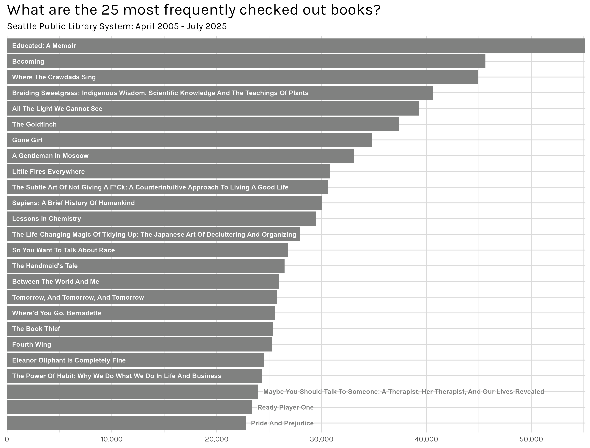{#fig-six width="100%" .lightbox}

@fig-six is about what I expected. There is a good mix of fiction and nonfiction and there are a lot of books I recognize from lists like the NYT bestsellers. I will say that, at least initially, I found it a little surprising how low these checkout numbers were. If the library is lending out \~700,000 books a month, how is the most frequently checkout out book-'Educated: A Memoir'- '*only*' checked out \~55,000 times in total? Doing some *extremely* rough napkin math, 'Educated: A Memoir', was published in 2018, which works out to \~650 checkouts a month[^3]. That still seems a little low for a city as big as Seattle, but it doesn't feel quite as, well, wrong as I initially thought.

[^3]: How did I simplify this? Well, the number of checkouts per month wasn't *always* 700,000, 2018 and 2025 aren't full years of data, and books rarely stay at consistent checkout levels for starters.

### Most Popular Books by Medium

Second, does the medium people are reading in affect what people read? Maybe people are more likely to read nonfiction with audiobooks--who doesn't love listening to a dense history or science book on their commute? Or people read more romance with ebooks--we've all had those books we are *slightly* embarrassed to be seen reading.

```{r top_titles_by_type, eval = FALSE}
total_checkouts_by_title_and_type <- monthly_checkouts |> 
  select(-ISBN) |> 
  janitor::clean_names() |> 
  filter_by_condition(material_type %in% c("BOOK", "EBOOK", "AUDIOBOOK"), !if_any(everything(), is.na)) |> 
  group_by(material_type, title) |> 
  summarise(total = sum(checkouts, na.rm = TRUE)) |> 
  arrange(desc(total)) |> 
  collect()

top_1000_type <- total_checkouts_by_title_and_type |> 
  slice_head(n = 1000) |> 
  mutate(title = tolower(title))

cleaned_totals_type <- tidy_titles(top_1000_type) |> 
  group_by(material_type, title) |> 
  summarise(total = sum(total, na.rm = TRUE)) |> 
  arrange(desc(total)) 

top_25_type <- cleaned_totals_type |> 
  slice_head(n = 12) |> 
  mutate(title = str_to_title(title))

e <- make_bar_plot(top_25_type |>  filter(material_type == 'EBOOK'), x_var = total, y_var = title,
                   .x_nudge = 100, .plot_subtitle = 'Ebooks',
                   .plot_title = "What are the top titles for each book type?", title_size = 16)
b <- make_bar_plot(top_25_type |>  filter(material_type == 'BOOK'), x_var = total, y_var = title,
                   .x_nudge = 50, .plot_subtitle = 'Books')
a <- make_bar_plot(top_25_type |>  filter(material_type == 'AUDIOBOOK'), x_var = total, y_var = title,
                   .x_nudge = 200, adjust_y = TRUE, filter_y_by = 15000, .plot_subtitle = 'Audiobooks')

top_books_by_medium <- e/b/a

# ggsave('top_books_by_medium.png', top_books_by_medium)
```

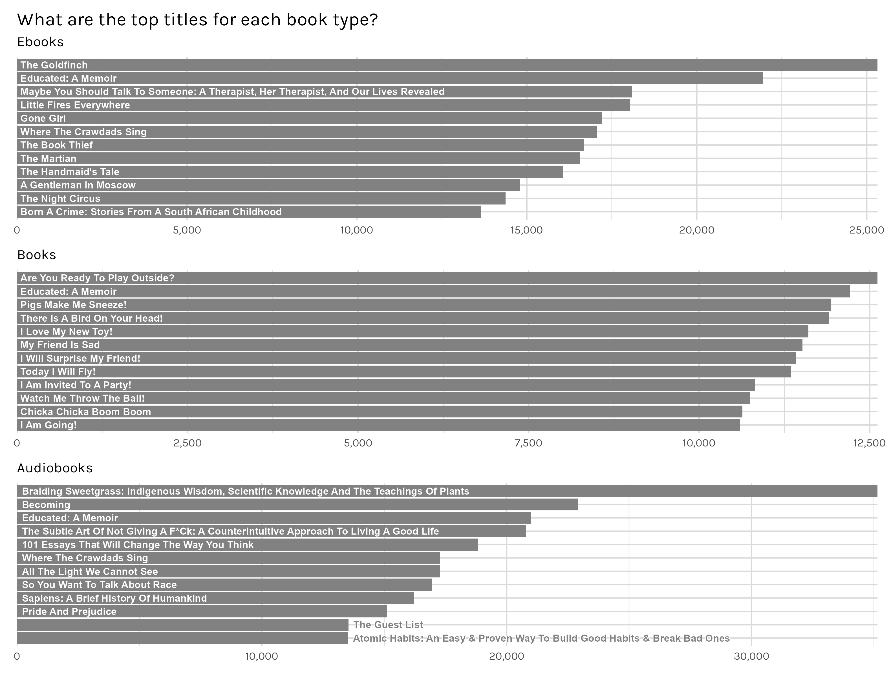{#fig-seven width="100%" .lightbox}

A little bit, yes. @fig-seven shows that physical books are dominated by children's books-it took me a minute, but eventually I realized 'I Love My New Toy!' was not a work of historical fiction. This makes sense to me as an e-ink ebook or an audiobook seem patently inferior to a bright, full color, picture-rich children's book. And the top ebooks and audiobooks are now mainly adult books. With audiobooks, you even see a majority of nonfiction now. I would not have expected this children/adult split before disaggregating the data, but in hindsight it's understandable. Anecdotally, I remember pretty vividly going to the library as a child and walking out with monumental towers of books. I don't think most households have the luxury of maintaining a massive library of children's books which will be outgrown within a couple years. The library is a great alternative! And on the other side, I would expect adults to be the earlier adopters of ebooks and audiobooks-they are the ones with the money to buy those devices. So it only makes sense that more adult oriented books are represented in those titles.

### And the Most Checked Out Book of The Year Is...

After seeing the most popular checkouts overall, I am curious what the most popular book every year is. This is mainly an indulgence to see how many I can guess or recognize, but I also want to see if maybe there are any noticeable trends in what's popular year after year.

```{r top_checkout_each_year, eval = FALSE}
top_by_year <- monthly_checkouts |> 
  select(-ISBN) |> 
  janitor::clean_names() |> 
  filter_by_condition(material_type %in% c("BOOK", "EBOOK", "AUDIOBOOK"), !if_any(everything(), is.na)) |> 
  group_by(title, checkout_year) |> 
  summarise(total = sum(checkouts, na.rm = TRUE)) |> 
  arrange(desc(total)) |> 
  collect()

# performing the regex title cleaning on 6m rows takes longer than I like. I can get the same results
# by taking the top chunk of each each and doing the analysis with just those books.
# this is substantial time savings
top_by_year_slice <- top_by_year |> 
  ungroup() |> 
  group_by(checkout_year) |> 
  arrange(desc(total)) |> 
  slice_head(n = 50000) |>
  #clean up titles so I can group variations on the same title together
  tidy_titles() |> 
  group_by(title, checkout_year) |> 
  summarise(total = sum(total, na.rm = TRUE)) |> 
  arrange(desc(total))

#get the top checkout for each year
top_book_each_year <- top_by_year_slice |> 
  ungroup() |> 
  group_by(checkout_year) |> 
  slice_head(n = 1) |> 
  ungroup() |> 
  mutate(old_title = str_to_title(title),
         title = paste0(old_title, "-", as.character(checkout_year))) |> 
  select(-checkout_year)


# since bar size varies so much, need to toggle adjust_title
most_popular_book_each_year <- make_bar_plot(top_book_each_year, x_var = total, y_var = title, .plot_title = 'What is the most checked out book for each year?',
                    .plot_subtitle = 'Fleeting Popularity: Only 8 books from this plot make the top 25 all time.', 
                    .x_nudge = 150, adjust_y = TRUE, filter_y_by = 5000)

# ggsave('most_popular_book_each_year.png', most_popular_book_each_year)
```

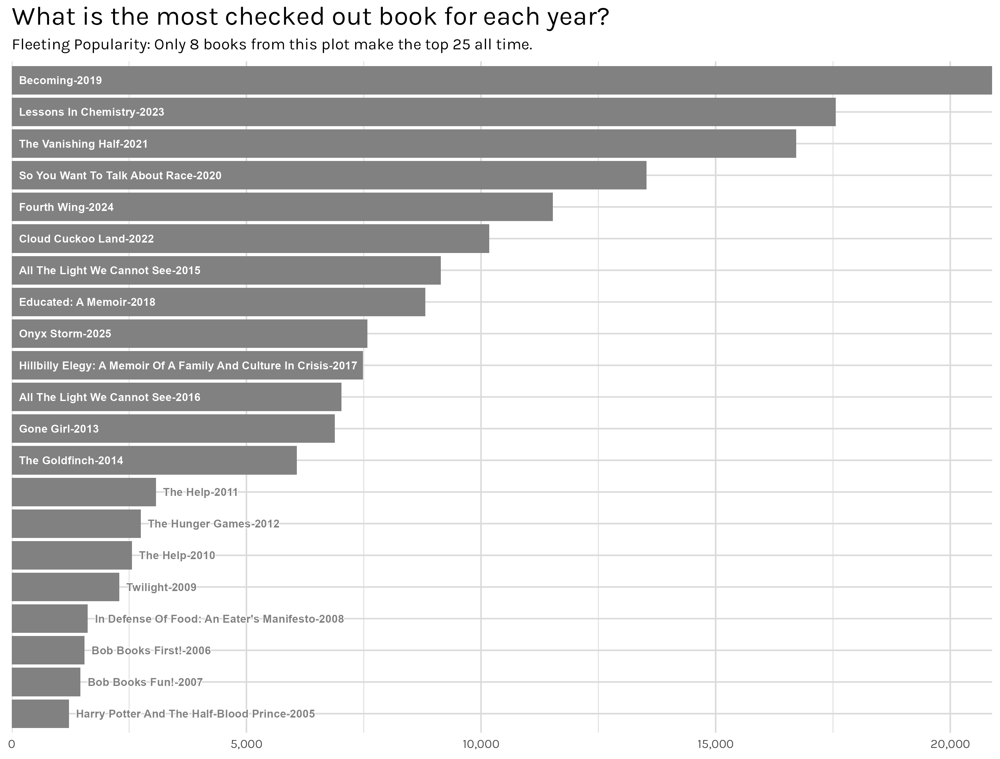{#fig-eight width="100%" .lightbox}

The first thing I notice in @fig-eight is that we only once see a book hold the top spot for multiple years-'The Help' in 2010 and 2011. Once I realized that, I double checked @fig-six and, sure enough, only 8 of the most popular books of a specific year make the all time top 25 list. Most popular books, it turns out, are flashes in a pan. They get heavily marketed when they are first published--the authors make the talk show rounds, they get placed on the NYT/New Yorker/Oprah lists, etc--but then after that initial blitz, attention moves on to the next book getting released.

In contrast, to be one of the most popular books *ever* at the library, you need sustained popularity over many years. I think this is a big factor in why I was surprised the most popular books ever topped out at such low checkout counts. Book popularity is too ephemeral to rack up large checkout counts. There is always a new, hot book people are talking about. I suppose that makes it all the more impressive that the '*classics*' stick around at all, but they are definitely deep into the long tail of the distribution. A bit later I'll examine whether this ephemerality effect is becoming stronger recently--effectively, do books spend less time popular than they used to.

One other point about @fig-eight - what's up with the massive increase in the number of checkouts of the most popular book in, say, 2023 versus 2011? We are talking about \~17,000 versus \~3,000 respectively! I think a good portion of this is explainable by the increase in library checkouts overall--total checkouts nearly double between 2011 and 2025--but it does seem like something else must be a factor as well. My hypothesis is that people might be reading more, but they are reading less broadly and so those popular books each year are *really* popular now and eat up a big chunk of total checkouts. Patience though, we'll get to that.

### Are People Fiction or Non-Fiction Readers?

I think one of the biggest differences in readers is between those that read fiction and those that read nonfiction. Personally, I split about 50/50, but I know plenty of people who read *only* one or the other. Am I the weird one or are they?! Let's look at checkouts of the two and see how it breaks down. Of course, I have to do some data munging to get to this fiction/nonfiction information. The dataset has a subject variable, but that subject is really a comma separated list of topics. That list is where the fiction/nonfiction label lives--amongst *many* other labels--and I can pretty easily do some filtering to get to the information I need[^4].

[^4]: If you are following along with the code, just be aware this subject_df is huge. It's well over 100 million rows and takes a good chunk of time to build even using duckdb.

```{r fiction_v_nonfiction, eval = FALSE}
# this is 100m+ row df. be careful with it
subject_df <- monthly_checkouts |>  
  #must remove ISBN column before using build_base_dataset or you'll filter out most of dataset since
  #it have ISBN = NA
  select(-ISBN) |> 
  janitor::clean_names() |> 
  build_base_dataset(condition = c(material_type %in% c("BOOK", "EBOOK", "AUDIOBOOK"),
                                 !if_any(everything(), is.na)),
                     variable = c(-usage_class, -checkout_type, 
                                -creator, -publisher, -publication_year)) |> 
  mutate(subjects = tolower(subjects)) |> 
  separate_longer_delim(subjects, delim = ', ')


fiction_and_nonfiction <- subject_df |> 
  filter(subjects %in% c("fiction", "nonfiction")) |> 
  group_by(checkout_year, subjects) |> 
  summarise(counts = sum(checkouts)) |> 
  arrange(desc(counts))

total_fiction_v_nonfiction <- fiction_and_nonfiction |> 
  ggplot(aes(x = checkout_year, y = counts, color = subjects))+
  geom_line()+
  geom_label(data = get_end_labels(fiction_and_nonfiction, checkout_year == max(checkout_year) - 2),
            aes(x = checkout_year, y = counts, label = subjects),
            hjust = -.2, fontface = 'bold', size = 3, family = 'Karla')+
  geom_vline(xintercept = 2011, linetype = 'dashed', color = 'black')+
  my_plot_theme()+
  line_plot_tweaks(x_is_date = FALSE)+
  labs(
    x = NULL,
    y = NULL,
    title = "Yearly checkouts of fiction and nonfiction books",
    subtitle = 'Ebook adoption coincides with a widening of the fiction v nonfiction gap'
  )+
  theme(
    legend.position = 'None'
  )+
  scale_x_continuous(breaks = seq(2005, 2025, by = 2))

# ggsave('total_fiction_v_nonfiction.png', total_fiction_v_nonfiction)
```

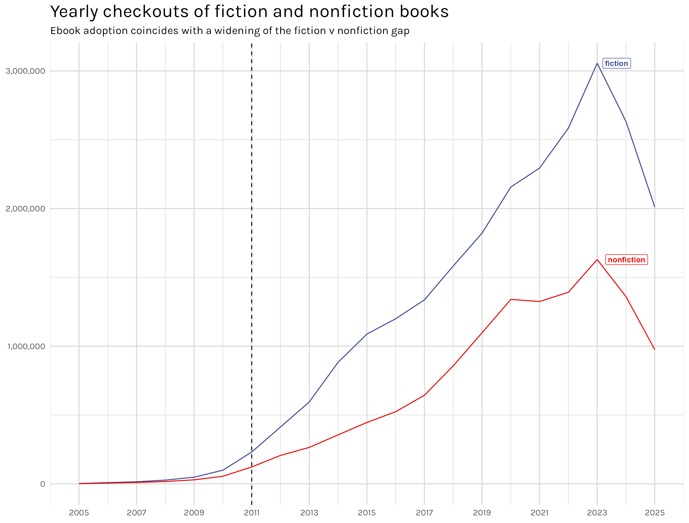{#fig-nine width="100%" .lightbox}

Broadly, people(at least Seattl-ites?) seem to read a good bit more fiction than nonfiction. But there is an interesting gap that opens up starting around 2011. That is when ebooks started to become popular. If I disaggregate this, I bet we can see what is happening more clearly.

```{r fiction_v_nonfiction_by_material_type, eval = FALSE}
#get typed dataframe
fiction_and_nonfiction_by_material_type <- subject_df |> 
  filter(subjects %in% c("fiction", "nonfiction")) |> 
  group_by(checkout_year, material_type, subjects) |> 
  summarise(counts = sum(checkouts)) |> 
  arrange(desc(counts))

total_fiction_v_nonfiction_by_medium <- fiction_and_nonfiction_by_material_type |> 
  ggplot(aes(x = checkout_year, y = counts, color = subjects))+
  geom_line()+
  facet_wrap(~material_type, scales = 'free_y')+
  geom_label(data = get_end_labels(fiction_and_nonfiction_by_material_type |> 
                                     group_by(material_type),
                                   checkout_year == max(checkout_year) - 5),
            aes(x = checkout_year, y = counts, label = subjects),
            hjust = -.2, fontface = 'bold', size = 3, family = 'Karla', nudge_y = 1000)+
  my_plot_theme()+
  line_plot_tweaks(x_is_date = FALSE)+
  labs(
    x = NULL,
    y = NULL,
    title = "Yearly checkouts of fiction and nonfiction books",
    subtitle = 'Subject labeling is strongly correlated with medium type'
  )+
  theme(
    legend.position = 'None'
  )+
  scale_x_continuous(breaks = seq(2005, 2025, by = 5))

# ggsave('total_fiction_v_nonfiction_by_medium.png', total_fiction_v_nonfiction_by_medium)
```

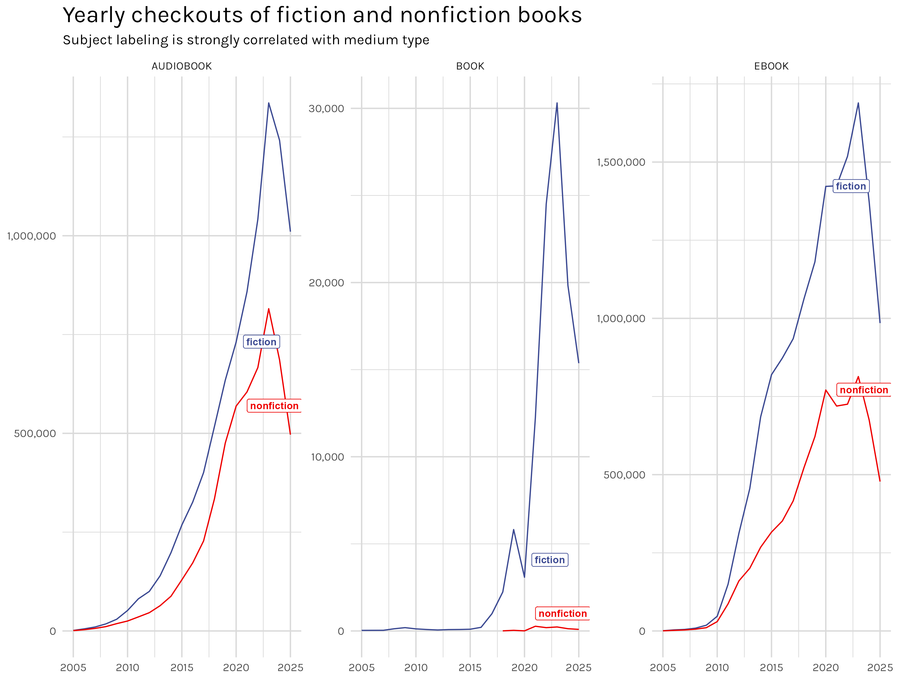{#fig-ten width="100%" .lightbox}

Well, that is unexpected. Almost no physical books are tagged as nonfiction and very few are even tagged as fiction[^5]. What is going on there? As far as I can tell, this is kind of a result of the Dewey Decimal system. Physical books have been classified by the [hierarchical Dewey system](https://en.wikipedia.org/wiki/List_of_Dewey_Decimal_classes#) for \~150 years. Notably, that system does not have nonfiction and fiction categories. Instead, you have classes, divisions and sections. So science is a class; that's broken down into divisions- science, mathematics, astronomy, physics, etc; and that's divided into sections-algebra, arithmetic, topology, etc. Ultimately, the result is that physical books are classified by the Dewey system while ebooks/audiobooks are classified by some other system. It's not hard to see how this will cause issues when we are trying to compare subject labeling, but books label in one manner and ebooks an entirely different manner.

[^5]: The plots make look similar at first glance, but double check the y-axis.

This might be clearer if I pull out a random book as an example.

```{r book_classification_example, eval = FALSE, include = FALSE}
class_example <- subject_df |> 
  filter(checkout_year == 2024) |> 
  mutate(title = tolower(title)) |> 
  filter(grepl('capital in the twenty', title)) |> 
  group_by(material_type) |> 
  count(subjects) 

capital_table <- class_example |> 
  ungroup() |> 
  select(-n) |> 
  gt() |> 
  tab_style(
      style = list(
        cell_text(weight = 'bold',
                  transform = 'capitalize'
                  )
      ),
      locations = cells_column_labels(everything())
    )

gtsave(capital_table, 'capital_table.png')
```

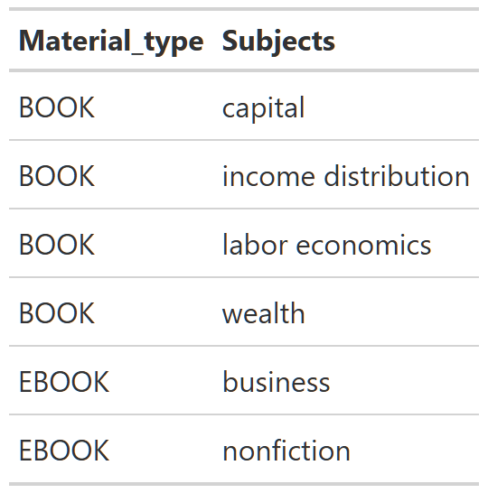{#tbl-six .lightbox}

@tbl-six show the subject labels for 'Capital in the Twenty-First Century'. You see that the physical book version lists the subjects as capital, income distribution, labor economics and wealth, but the ebook version labels it as business and nonfiction. That is *very* different and every book in the dataset is like this. This certainly muddies the picture of what fiction versus nonfiction actually means in the dataset. Thinking back to @fig-nine, it seems like the marked increase in fiction and nonfiction labels is just an artifact of the prevalence of the labeling systems changing with the transition to ebooks/audiobooks. We saw a huge increase in fiction and nonfiction subject tags because, unlike physical books, that's how these new types of books chose to label them!

### What Subjects do People Love to Read About?

Since fiction and nonfiction labeling is clearly biased by medium type, maybe looking at the specific subjects of the books will yield more helpful information about what people are reading.

```{r top_subjects_by_book_type, eval = FALSE}
book_type_subjects <- subject_df |> 
  group_by(material_type, subjects) |> 
  summarise(counts = sum(checkouts)) |> 
  arrange(desc(counts))

books <- make_bar_plot(book_type_subjects |> 
                filter(material_type == 'BOOK') |> 
                slice_head(n = 12) |> 
                ungroup() |> 
                  mutate(subjects = str_to_title(subjects)) , 
              x_var = counts, y_var = subjects, .x_nudge = 20000, .plot_subtitle = 'Books',
              .plot_title = 'What are the most commonly read subjects?', title_size = 14)

ebooks <- make_bar_plot(book_type_subjects |> 
                filter(material_type == 'EBOOK') |> 
                slice_head(n = 14) |> 
                ungroup() |> 
                  mutate(subjects = str_to_title(subjects)) |> filter(!grepl("^Fiction|^Nonfiction", subjects)), 
              x_var = counts, y_var = subjects, .x_nudge = 25000, .plot_subtitle = 'Ebooks'
              )

audiobooks <- make_bar_plot(book_type_subjects |> 
                filter(material_type == 'AUDIOBOOK') |> 
                slice_head(n = 14) |> 
                ungroup() |> 
                  mutate(subjects = str_to_title(subjects)) |> filter(!grepl("^Fiction|^Nonfiction", subjects)), 
              x_var = counts, y_var = subjects, .x_nudge = 15000, .plot_subtitle = 'Audiobooks')

top_subject_by_medium <- books /ebooks / audiobooks

# ggsave('top_subjects_by_medium.png', top_subject_by_medium)
```

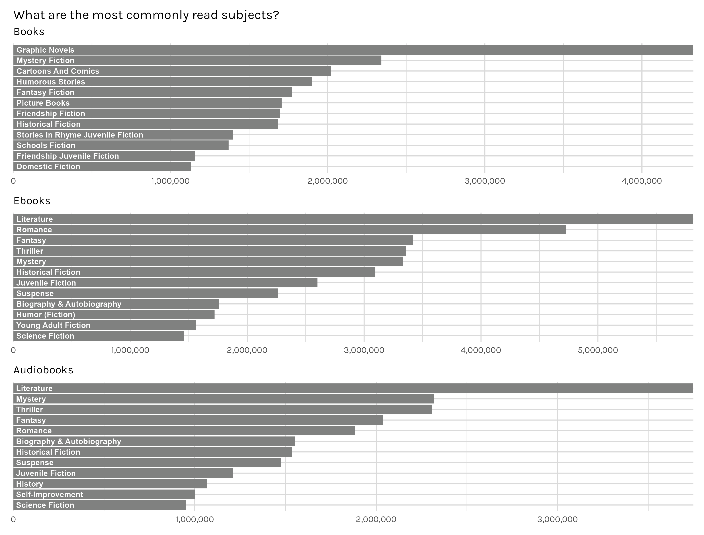{#fig-eleven width="100%" .lightbox}

Looking at the top subject labels by medium type, all three look fairly similar with one exception. As we saw in @fig-seven, physical books again have a higher prevalence of graphic or picture focused books--in this case graphic novels, cartoons, picture books(and also probably stories in rhyme). As before, that makes complete sense to me--what would listening to an audiobook of a graphic novel even look like? Aside from the graphical books, the rests of the lists look very similar[^6] and are pretty much what I'd expect. People have long loved mysteries, romance novels, fantasy series, etc. I will point out that romance novels are the second most popular subject for ebooks--my tongue-in-cheek remark about people being embarrassed to be seen reading romance may hold true after all!

[^6]: Obviously, subjects like Fantasy Fiction are the same thing as Fantasy.

I think the main takeaway here is that while physical books have a *much* more specific classification system, ultimately people seem to read similar subjects, regardless of the medium. Take a look at @tbl-seven below.

```{r number_of_subjects_table, eval = FALSE}
total_subjects <- subject_df |> 
  distinct(material_type, subjects) |> 
  group_by(material_type) |> 
  summarise(total = n())
  

  
book_sub_sample <- subject_df |> 
  distinct(material_type, subjects) |> 
  filter(material_type == 'BOOK') |> 
  slice_head(n = 10)

subject_count <- wrap_table(total_subjects |> gt() |> format_table_header()) +
  wrap_table(book_sub_sample |>  gt() |>  tab_style(
      style = list(
        cell_text(weight = 'bold',
                  transform = 'capitalize'
                  )
      ),
      locations = cells_column_labels(everything())
    ))

# ggsave('subject_count.png', subject_count, height = 4)
```

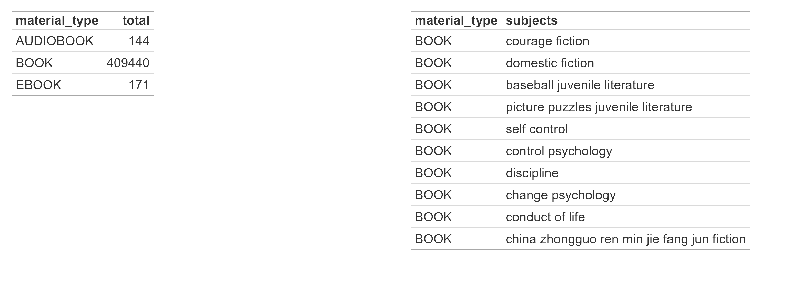{#tbl-seven width="100%" .lightbox}

@tbl-seven is just a count of how many different subject labels there are for each medium type. That is not a mistake--physical books have over 400,000 different subject classifications! You can glimpse the specificity in the slice of book subjects, but it really is incredible the level of detail the subject categorization goes into. Ebooks and audiobooks are not remotely at the same level of detail. Like I said though, I'm not sure this matters. The 'popular' subjects are more or less the same across the mediums.

One final point on subjects: while it's true that the fiction/nonfiction descriptor is useless when comparing between physical books and digital books, the data is pretty clear within ebooks and audiobooks--people read roughly twice as much fiction as nonfiction as seen in @fig-twelve.

```{r digital-fiction-nonfiction, eval = FALSE}
book_type_subjects <- subject_df |> 
  group_by(material_type, subjects) |> 
  summarise(counts = sum(checkouts)) |> 
  arrange(desc(counts))

ebooks_fiction_nonfiction <- make_bar_plot(book_type_subjects |> 
                filter(material_type == 'EBOOK') |> 
                slice_head(n = 2) |> 
                ungroup() |> 
                  mutate(subjects = str_to_title(subjects)) , 
              x_var = counts, y_var = subjects, .x_nudge = 25000,
              .plot_title = "Do readers of digital mediums prefer fiction or nonfiction?",
              .plot_subtitle = 'Ebooks'
              )

audiobooks_fiction_nonfiction <- make_bar_plot(book_type_subjects |> 
                filter(material_type == 'AUDIOBOOK') |> 
                slice_head(n = 2) |> 
                ungroup() |> 
                  mutate(subjects = str_to_title(subjects)) , 
              x_var = counts, y_var = subjects, .x_nudge = 15000, .plot_subtitle = 'Audiobooks')

digital_fiction_v_nonfiction <- ebooks_fiction_nonfiction / audiobooks_fiction_nonfiction

# ggsave('digital_fiction_v_nonfiction.png', digital_fiction_v_nonfiction)


temp <- subject_df |> 
  filter(material_type != 'BOOK', subjects == 'fiction' | subjects == 'nonfiction') |> 
  group_by(material_type, checkout_year, subjects) |> 
  summarise(counts = sum(checkouts)) 

digital_fiction_v_nonfiction_yearly <- temp |> 
  ungroup() |> 
  ggplot(aes(x = checkout_year, y = counts, group = subjects, color = subjects))+
  geom_line()+
  facet_wrap(~material_type)+
  my_plot_theme()+
  line_plot_tweaks()+
  labs(
    x = "",
    y = "Total  Checkouts",
    title = 'Is the number of readers who prefer fiction over nonfiction increasing?',
    subtitle = '',
    color = ""
    
  )+
  theme(
    legend.position = 'bottom'
  )

# ggsave('digital_fiction_v_nonfiction_yearly.png', digital_fiction_v_nonfiction_yearly)
```

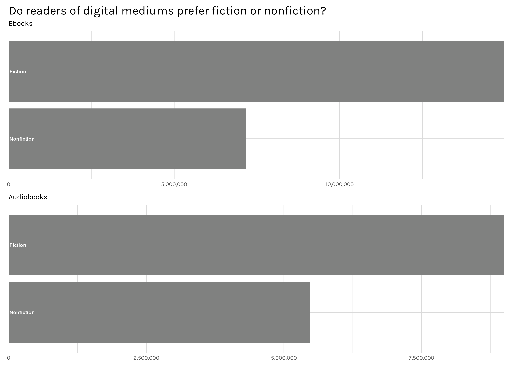{#fig-twelve width="100%" .lightbox}

If you look at the yearly breakdown in @fig-thirteen, it even looks like that preference is increasing over time. However, after looking into it, I don't think that is true. The yearly increase in digital checkouts as a whole is increasing faster than the increase in fiction v nonfiction checkouts, so I think the apparent increase is mainly a mirage caused by the fast growth of digital checkouts as a whole.

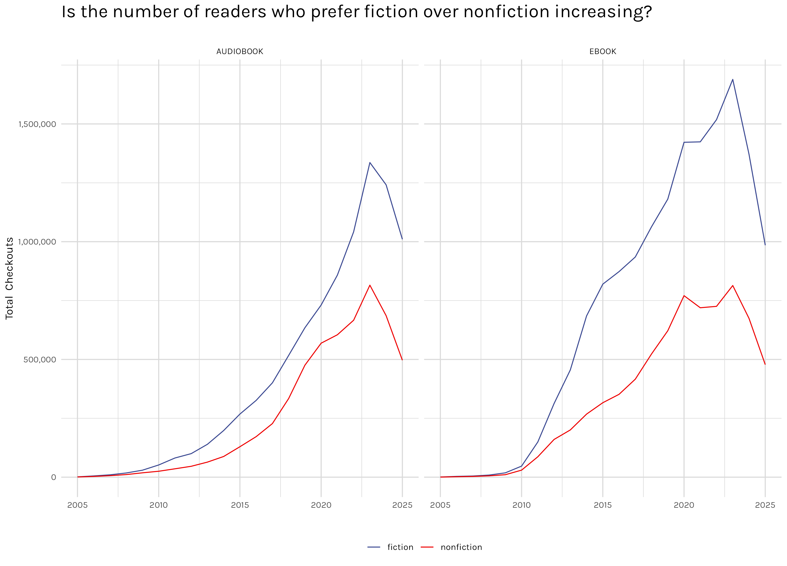{#fig-thirteen width="100%" .lightbox}

### Who Are the Most Popular Authors?

One last stop on the 'what people read' tour is a brief look at the most popular authors. I have a feeling this will be a lot of industry standards. Think Stephen King, James Patterson or Jodi Piccoult. Once again, our friend messy data makes an appearance. Author names also suffer from the multiple versions problem I encountered with titles. A little more data munging and we come up with @fig-fourteen.

```{r popular_authors, eval = FALSE}
author_totals <- monthly_checkouts |> 
  select(-ISBN) |> 
  janitor::clean_names() |> 
  build_base_dataset(condition = c(material_type %in% c("BOOK", "EBOOK", "AUDIOBOOK"),
                                 !if_any(everything(), is.na)),
                     variable = c(-usage_class, -checkout_type, 
                                 -publisher, -publication_year)) |> 
  group_by(creator) |> 
  summarise(total = sum(checkouts)) |> 
  #names suffer from multiple variations; clean them up to group them together
  mutate(first = str_split_i(creator, ", ", 2),
         last = str_split_i(creator, ", ", 1)) |>
  mutate(new_name = if_else(is.na(first), last, paste0(first, " ", last))) |> 
  ungroup() |> 
  group_by(new_name) |> 
  summarise(total = sum(total))

top_authors <- make_bar_plot(author_totals |> arrange(desc(total)) |> 
                slice_head(n = 25), x_var = total, y_var = new_name,
              .x_nudge = 2000,
              .plot_title = 'Who are the most checked out authors?',
              .plot_subtitle = 'Top authors are split roughly 50/50 between childrens authors and adult authors')

# ggsave('top_authors.png', top_authors)
```

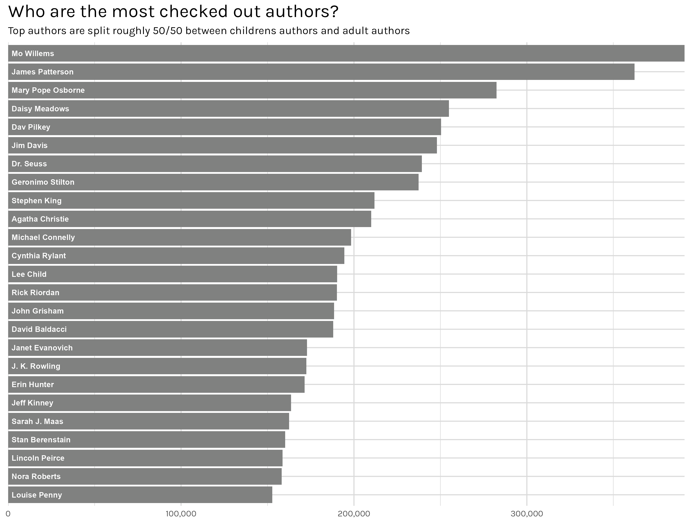{#fig-fourteen width="100%" .lightbox}

I was partially right!. The list is roughly an even split between authors of kids books and authors of popular adult books. While I'd love to see more variety or 'more serious' literature authors on there, I try not to book shame anyone. If you are reading, you are heading in the right direction in my book.

## Are People Reading Less Broadly?

The final question I want to address in the exploratory analysis is also probably the most confusing. We've seen in the exploration so far that some books are orders of magnitude more popular than others. My hypothesis is that these ultra popular books are becoming *more* popular over time, eating up ever greater shares of the total number of checkouts. Since people only have a finite amount of time in their day, I'm assuming that if they read one of these popular books, they miss out on reading one less popular book, and thus, the population as a whole would be reading from a smaller subset of books. That's my idea of what 'reading less broadly' means.

I think one way to answer this question is to look at a book(or books) 'share' of total checkouts. For example, does it take the top 100 most checked out books to add up to 50% of all checkouts? Or does it take 1000 books to get to 50%? If it is 1000 books, then the population is reading more broadly than if it takes 100. In the extreme, if all checkouts were of the same book, that book would be 100% of total checkouts, and the population wouldn't be reading very broadly at all. I am interested in how much, or if, this book share has changed throughout the lifespan of the dataset. Let's munge some data and see.

```{r proportion_of_checkouts_plot, eval = FALSE}
proportion_of_total_checkouts <- monthly_checkouts |> 
  select(-ISBN) |> 
  janitor::clean_names() |> 
  filter_by_condition(checkout_year != 2005, checkout_year != 2006, checkout_year != 2025) |> 
  build_base_dataset(condition = c(material_type %in% c("BOOK", "EBOOK", "AUDIOBOOK"),
                                 !if_any(everything(), is.na)),
                     variable = c(-usage_class, -checkout_type, -creator,
                                 -publisher, -publication_year)) |> 
  tidy_titles() |> 
  group_by(checkout_year, title) |> 
  #calculate checkout counts for each title for each year
  summarise(checkouts = sum(checkouts)) |> 
  # summarise droped the title grouping, so only grouped by year now; 
  # calculate proportion of total checkouts for year for each title
  mutate(prop_checkouts = checkouts/sum(checkouts)) |> 
  arrange(desc(checkouts))
  

cumulative_proportion_of_total_checkouts <- proportion_of_total_checkouts |> 
  # ordered from most to fewest checkouts, calculate running perc of total checkouts for year
  mutate(perc_of_total = cumsum(prop_checkouts)/sum(prop_checkouts)) |> 
  mutate(row_num = row_number(),
         checkout_year = as.factor(checkout_year))

all_books <- cumulative_proportion_of_total_checkouts |> 
  ggplot(aes(x = row_num, y = perc_of_total, color = checkout_year))+
  geom_line(linewidth = .8)+
  geom_hline(yintercept = .75, linetype = 'dashed', color = 'gray8')+
  scale_x_continuous(labels = scales::label_comma())+
  scale_y_continuous(labels = scales::label_percent())+
  paletteer::scale_color_paletteer_d("cartography::turquoise.pal", dynamic = TRUE)+
  # paletteer::scale_color_paletteer_d("dichromat::BluetoDarkOrange_18")+
  my_plot_theme()+
  labs(
    x = "# of Books",
    y = "Proportion of Total Checkouts",
    title = 'Are people reading a smaller and smaller subset of books?',
    subtitle = 'It took ~twice as many books to reach 75% of total checkouts\n in 2024 versus 2007'
  )+
  theme(
    legend.position = 'inside',
    legend.title = element_blank(),
    legend.position.inside = c(.94, .35),
    legend.key.width = unit(10, 'mm')
  )+
  guides(linetype = guide_legend(override.aes = list(size = 2)))

top_100 <- cumulative_proportion_of_total_checkouts |> 
  filter(row_num <= 100) |> 
  ggplot(aes(x = row_num, y = perc_of_total, color = checkout_year))+
  geom_line(linewidth = .8)+
  geom_vline(xintercept = 100, color = 'black')+
  # geom_hline(yintercept = .25, linetype = 'dashed', color = 'gray8')+
  scale_x_continuous(labels = scales::label_comma())+
  scale_y_continuous(labels = scales::label_percent())+
  paletteer::scale_color_paletteer_d("cartography::turquoise.pal", dynamic = TRUE)+
  # paletteer::scale_color_paletteer_d("dichromat::BluetoDarkOrange_18")+
  my_plot_theme()+
  labs(
    x = "# of Books",
    y = NULL,
    subtitle = 'However, the top 100 most checked out books make up ~6% \n of total checkouts in 2024 versus ~3-4% in 2007 '
  )+
  theme(
    legend.position = 'None'
  )

proportion_of_total_checkouts_plot <- (all_books + top_100) + 
  plot_annotation(tag_levels = "A",tag_prefix = "(", tag_suffix = ")") & theme(plot.tag.position = 'bottom')

# ggsave('proportion_of_total_checkouts_plot.png', proportion_of_total_checkouts_plot)
```

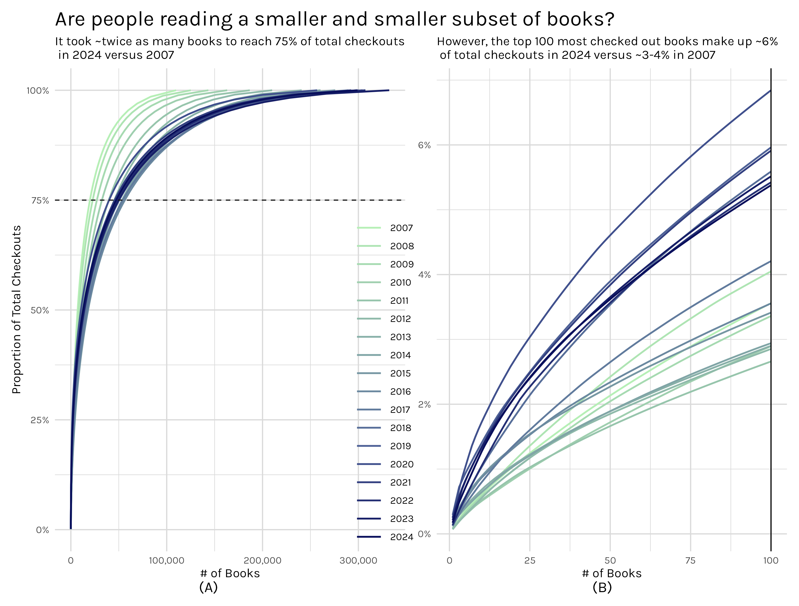{#fig-fifteen width="100%" .lightbox}

@fig-fifteen is a really interesting plot, though it might be slightly confusing at first. In plot A, I took all books and looked at their share of total checkouts. If there were 1000 total checkouts and book A was checked out 150 times, its share of total checkouts would be 15%. If I had a second book, book B, that was checked out 100 times, that books checkout share is 10%. After doing that for every book, if you order the books by checkout share, you can cumulatively sum them up and see the share of total checkouts that X number of books represents. So in my toy example, book A and book B make up 25% of the total checkouts of all books. Plot A is showing the results of doing just that with all the books in the dataset, but also breaking it down by year. In plot A, we can see that earlier years are shifted to the left, meaning there are fewer books. So plot A indicates that people are reading *more* broadly. In 2007, it took roughly 25k different books to make up 75% of total checkouts. By 2024, that number has gone *up* to roughly 50k different books representing 75% of checkouts. This holds true even when you break down the totals into ebooks, books, and audiobooks.

Plot B offers a caveat. Plot B essentially zooms in to look at just the top 100 most checked out books and ask what percentage of checkouts do those 100 books represent? We can get that percentage by looking where the curves intersect with the black line on the right. Here, we see that later years in our dataset hover around 5.5-6% while earlier years are more in the 3-4% range. So the small subset of the most popular books(think NYT bestsellers) represent about twice the share of total checkouts as they did a little over a decade ago.

So which is it then? Are people reading more or less broadly? I think a good way to think of this is that yes, popular books are more popular, but our reading distributions have fatter tails. There are all sorts of reasons both of these things can simultaneously be true. Maybe major publishers are advertising tentpole books more aggressively and for longer time periods, but also publishing is cheaper(not to mention the viability of self publishing these days) so a wider list of titles are available to checkout. I would need to bring in some other data sources, like perhaps the inventory of the library, to really dive into this, but that's an analysis for another day.

Long story short, people seem to be reading a little *more* broadly, but the most popular books are a little *more* popular.

# Can We Predict How Many Checkouts a Title Will Have Each Month?

Initially, I was mainly excited to do some visualization with this rich dataset. After playing with it for a bit, I realized there were some interesting modeling questions too. For my purpose here, I just want to do a proof of concept. Say we are interesting in providing a prediction of how many times a physical book is going to be checked out next month? Maybe the library wants to make sure books that are probably going to be popular are in prime, easy to see spots when you walk in the library? Maybe they want to allocate more shelf space to books they think are going to be popular? Or maybe they need to have an estimated number of checkouts so they can make sure their stock is high enough in the right branches to meet that demand? There are all sorts of reasons the library might want this info, so let's see how hard it would be to provide it.

## Building the Modeling Dataset

First things first, I need to build a modeling dataset. My feature engineering pipeline does multiple things at once:

-   Remove ISBN variable: ISBN is almost completely NA and not useful
-   build_base_dataset[^7]: Filters to physical books only and only those with complete information
    -   Also gets rid of variables that we won't use in modeling
-   select_top_n_books: Determines the n most checked out books of the dataset and then filters the dataset to return just those n titles
-   add_features: Generates a set of new features for our model. These include:
    -   Numerous lagged and rolling average features
    -   Median, Mean, Standard Deviation of monthly checkouts
    -   Booleans for whether the data is from a summer month, is a children's book, etc.
    -   Numeric variables describing how old the book is

[^7]: Most of the heavy lifting for the modeling is done by functions in the helper_function file. You can check out its details in the [github repo](https://github.com/houlad/SeattleLibrary).

    ```{r build_model_dataset, eval = FALSE}
    top_1000_books_new_features <- monthly_checkouts |>
      select(-ISBN) |>
      build_base_dataset(condition = c(UsageClass == "Physical", MaterialType == 'BOOK',
                                  !if_any(everything(), is.na)),
                    variable = c(-UsageClass, -CheckoutType, -MaterialType,
                                 -Subjects)) |> 
      select_top_n_books(.n = 1000) |> 
      add_features(add_rolling_avg_vars = TRUE,
                   add_lagged_vars = TRUE, 
                   g_vars = "title",
                   .n_lags = c(1, 2, 3, 6, 12),
                   .n_avgs = c(2, 3, 4, 5, 6, 12 ))

    # save a pin of this data
    # model_board <- pins::board_folder(path = 'data/final', versioned = TRUE)
    # pins::pin_write(model_board, name = 'dataset', x = top_1000_books_new_features, type = 'rds')
    ```

One very important thing to note right away is that I'm only using a tiny fraction of the total books in this modeling dataset. I'm building my model with data from only the top 1000 books--in a dataset with nearly 900,000 titles! The main reason is time. With the rudimentary model pipeline I built here, it takes on the order of 10x longer to train the model on 1000 books versus 10 books. Adding even more books gets time prohibitive *very* quickly. More importantly though, while this extra data does improve the model, it doesn't improve it *that* much and it's definitely not worth the time for this prototype.

## Building an Xgboost Model

After the dataset is built, I use a standard tidymodels framework to build an xgboost model. I'm not going to go into details about the workflow, but the full pipeline is below if you are interested. Why did I choose an xgboost model? They typically perform well on this sort of problem and they are quite easy to implement. In many circumstances they are at or near the state of the art for forecasting.

Another approach I tried that seems like it should work, but I couldn't get to perform well was hierarchical time series modeling. Think about stores like Walmart. They have thousands of products that they want to forecast sales for. How do they do that? Let's say we are forecasting toothbrushes specifically. Well, they could take toothbrushes and look at past sales and then use something like ARIMA/ETS to forecast the sales for that toothbrush in the future. The problem is that Walmart sells thousands(tens of thousands?) of different products. Even with relatively simple ARIMA models, it quickly becomes extremely computationally demanding to forecast each individual item. Not to mention they are going to want to update those forecasts frequently!

That problem sounds somewhat familiar! So how do they do it? Luckily for Walmart, their products fit nicely into hierarchies/groups. A toothbrush can be categorized like so: *personal care product -\> oral care product -\> toothbrushes -\> manual toothbrush -\> specific toothbrush*. Every product Walmart sells can be organized into a hierarchy like that and then [hierarchical time series forecasting](https://otexts.com/fpp3/hts.html) will use that structure to provide a coherent forecast that is feasible for a huge number of products. In theory, I think this should have worked pretty well for forecasting books, but it didn't. I'm not totally sure why, but my guess is that I didn't have a great group/hierarchical structure that fit the data. I tried something like *publisher -\> author -\> title*, but that isn't a very rich hierarchy nor was it particularly rigid--titles often have multiple publishers/authors/publication dates/etc. All of those little subtleties made building a good hierarchical structure difficult. Whatever the reason, I was able to outperform my hierarchical time series models pretty quickly with a xgboost model.

Another potential reason ARIMA forecasting failed to perform was the structure of a typical, popular book time series. @fig-sixteen shows the monthly time series plot for checkouts of 'The Goldfinch'. This structure is very common with popular books- an enormous initial peak, followed by a fairly rapid decline into a steady state of a couple dozen checkouts a month at most. This level shift is not something ARIMA is well suited for. With differencing perhaps you could make it work, but I don't think it's the most natural approach.

```{r goldfinch_example, eval = FALSE, include = FALSE}
goldfinch <- monthly_checkouts |> 
  filter_by_condition(UsageClass == "Physical", MaterialType == 'BOOK') |> 
  janitor::clean_names() |> 
  collect() |> 
  filter(grepl('The goldfinch.*', title)) |> 
  tidy_titles() |> 
  filter(title == 'the goldfinch')

goldfinch_ts_plot <- goldfinch |> 
  mutate(year_month = as.Date(tsibble::yearmonth(paste0(checkout_year, " ", checkout_month)),
                              "%Y %m")) |> 
  group_by(title) |> 
  ggplot(aes(x = year_month, y = checkouts))+
  geom_line()+
  my_plot_theme()+
  line_plot_tweaks()+
  labs(x = NULL,
       y = NULL,
       title = 'Monthly Checkouts for The Goldfinch',
       subtitle = 'Book checkouts spike after release, drop precipitously after about a year and then settle into relatively low levels')
  
# ggsave('goldfinch_ts_plot.png', goldfinch_ts_plot)

```

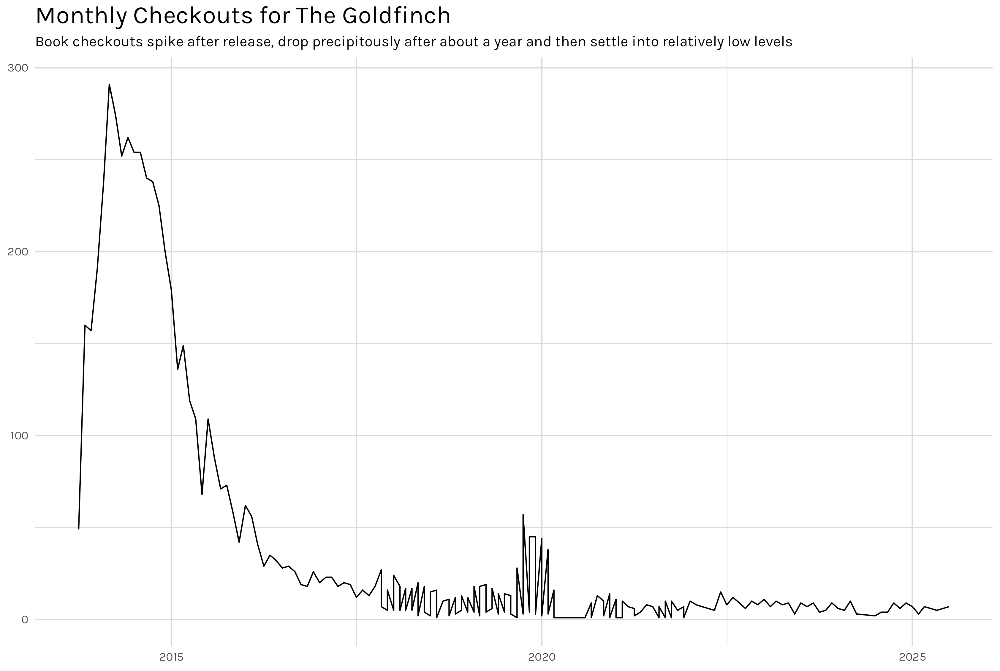{#fig-sixteen width="100%" .lightbox}

```{r build_xgboost_model, eval = FALSE}
#| code-fold: show
library(tidymodels)
library(future)
library(tictoc)
library(vip)
#using 90% of the data as training, 10% testing 
#This is ordered by year_month, so the last 10% of the dataset is used as testing set
#This ends up being Dec 2023 - July 2025
books_split <- initial_time_split(top_1000_books_new_features|> arrange(year_month), prop = .9)
training <- training(books_split)
testing <- testing(books_split)

#xgboost_recipe
xgboost_recipe <- recipe(
  checkouts ~ checkout_year + checkout_month + is_new +
              lag_1 + lag_2 + lag_3 + lag_6 + lag_12+ 
              rolling_avg_2_month + rolling_avg_3_month + rolling_avg_4_month + 
              rolling_avg_5_month + rolling_avg_6_month +
              avg_book_checkouts + is_summer + is_december +
              month_sd + months_old + median_book_checkouts+
              is_childrens_book+ checkout_book_sd,
  data = training) |> 
  step_dummy(all_nominal_predictors()) 

# specify spec
xgboost_spec <- 
  # standard set of tree parameters to tune
  boost_tree(trees = tune(),
             learn_rate = tune(),
             tree_depth = tune(),
             min_n = tune()) |> 
  set_mode("regression") |> 
  set_engine("xgboost")

#build tuning grid
grid <- grid_space_filling(
  tree_depth(),
  min_n(),
  learn_rate(),
  trees(),
  size = 10
)

# xgboost workflow
xgboost_workflow <-
  workflow() |> 
  add_recipe(xgboost_recipe) |> 
  add_model(xgboost_spec)

# generate folds for cross validation
folds <- vfold_cv(training)

#set of metrics to be used for tuning and evaluation
my_metrics <- metric_set(rmse, mape, mae, mase)

#fit model and tune grid parameters
#using tic/toc to see how long this takes; using future::plan to fit in parallel
tic()
plan(multisession, workers = 14)
xgboost_tune <- 
  tune_grid(xgboost_workflow, resamples = folds, grid = grid, 
            control = control_grid(verbose = TRUE),#, save_pred = TRUE, save_workflow = TRUE),
            metrics = my_metrics)
toc()

#select the best tuning parameters
best_fit <- select_best(xgboost_tune)

#feed the optimal tuning parameters into the workflow
xgb_fit <- finalize_workflow(xgboost_workflow, best_fit)

#with the best model in hand, fit the final model on the training set; then evaluate on the test set
final <- last_fit(xgb_fit, books_split)

# save version of model
deployable_model <- xgb_fit |>  fit(training)

vet_model <- vetiver_model(deployable_model, 'final_model_large')

model_board <- pins::board_folder(path = 'data/final', versioned = TRUE)

model_board |>
  vetiver_pin_write(vet_model)
```

In a nutshell, the pipeline I actually used takes the top 1,000 book dataset I generated earlier and then

1)  Splits the data into training/testing sets
2)  Builds a xgboost model recipe with all the features I want
3)  Builds a model specification--essentially I tell the pipeline I want a regression xgboost model and what model features I want to tune
4)  Builds a tuning grid with model features I need to tune - \# of trees, tree depth, learning rate, etc
5)  Adds all of this to a model workflow
6)  Trains the model in parallel with cross validation and the metrics I tell it to use
7)  Selects the best parameters according to tuning, finalizes the workflow, and fits the model on the training set
8)  Saves the model in a pin for later deployment and use

## Evaluate the Model

Now that the model is fit and saved, I can begin to evaluate it.

```{r model_evaluation, eval = FALSE}
# load pin of final model
data_board <- pins::board_folder(path = 'data/final')
final_model <- pins::pin_read(board = data_board, name = 'final_model_large')

# load pin of dataset used to build final model
model_dataset <- pins::pin_read(data_board, 'dataset', version = "20250924T150811Z-9067c")
# split the dataset back into training and testing sets
books_split <- initial_time_split(model_dataset |> arrange(year_month), prop = .9)
training <- training(books_split)
testing <- testing(books_split)

#View metrics
xgboost_error_metrics_table <- testing |>
  bind_cols(.preds = final_model$model |> unbundle() |>  predict(testing) |> zero_bound_predictions()) |>
  my_metrics(truth = checkouts, estimate = .pred) |> 
  gt() |> 
  tab_style(
      style = list(
        cell_text(weight = 'bold',
                  transform = 'capitalize'
                  )
      ),
      locations = cells_column_labels(everything())
    )

gtsave(xgboost_error_metrics_table, 'xgboost_error_metrics_table.png')
```

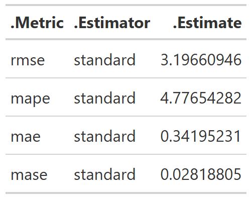{#tbl-eight .lightbox}

As you can see in @tbl-eight, with a relatively small chunk of the dataset, 1000 books, I'm able to predict checkout counts to within about 3 books a month. We can also look at it as we are off by an average of about 5% on our predictions. That seems pretty solid to me! One important caveat is that I have zero-bounded our predictions. You can't have a negative amount of books checked out, but the model can predict negative values. After fitting the model and generating the predictions, I simply ran through them and set any negative prediction to be equal to zero instead. There is probably a more elegant solution, but I think it makes sense in this use case.

```{r prediction_glance, eval = FALSE}
#View a portion of the predictions
example_predictions <- testing |>
  bind_cols(.preds = final_model$model |> unbundle() |>  predict(testing) |> zero_bound_predictions()) |> 
  select(.pred, checkouts) |> 
  mutate(.pred = round(.pred, 2)) |> 
  bind_cols(testing |>  select(title, year_month)) |> 
  head() |> 
  gt() |> 
  tab_style(
      style = list(
        cell_text(weight = 'bold',
                  transform = 'capitalize'
                  )
      ),
      locations = cells_column_labels(everything())
    )
gtsave(example_predictions, 'example_predictions.png')
```

If metrics make your eyes glaze over, @tbl-nine shows some of our model predictions versus the real checkout counts. As you can see, these predictions are not bad at all.

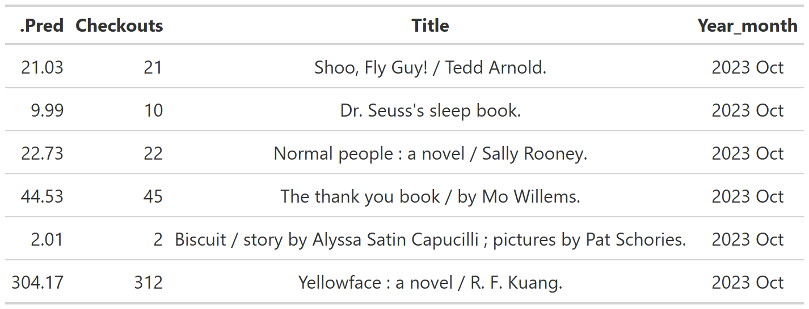{#tbl-nine .lightbox}

Aside from pure model performance, I also am interested in what features are important in my model. I can visualize this with some variable importance plots(VIP).

```{r vip_plot, eval = FALSE}
#Plot the most important features in the model
vip_plot <- final_model$model |>
  unbundle() |> 
  extract_fit_parsnip() |>
  vip(geom = 'point') + 
  my_plot_theme()+
  labs(
    title = 'Which model variables contribute the most to the model?'
  )

ggsave('vip_plot.png', vip_plot)
```

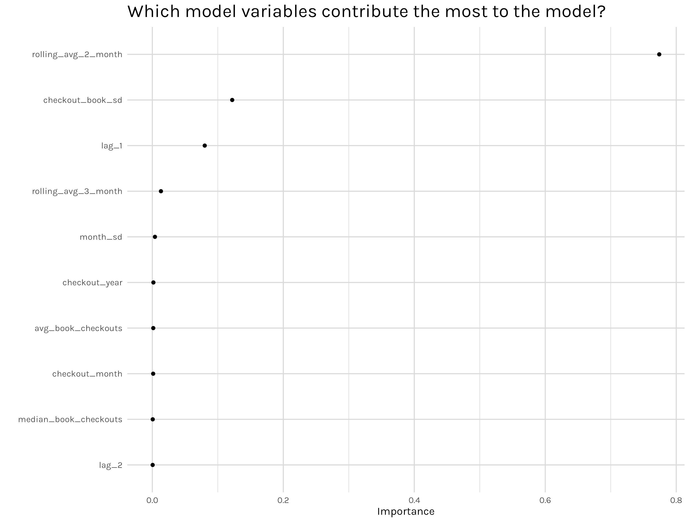{#fig-seventeen width="100%" .lightbox}

@fig-seventeen shows the *rolling two month average* as far and away the most important feature. Intuitively, that makes a ton of sense to me--what will next months checkouts be? Take the last two months checkouts, average them and predict that. That could be a good base model on its own-in fact it is essentially the MA(moving average) part of ARIMA time series forecasting. After the two month rolling average, we see that *checkout standard deviation* and the *lag 1* rank very highly, followed by a bunch of variables of similar importance. One thing I did find surprising is that dummy variables identifying whether a book was a children's book or whether the month was a summer month or Christmas month didn't really help the model at all.

## Deploy Model

Now that I have a working, semi-decent model, I want to set up an API so that I could deploy this into the world and actually use it-maybe in a shiny app or some other website/dashboard. The easiest way to do this is with vetiver, pins, and plumber. After you have your final, tuned model with your best parameters, you create a vetiver object that will contain all the information necessary to store, version and deploy the model. You then create a model board to write your model to. In a production setting, this would be something like board_s3 or board_rsconnect to deploy through Amazon AWS or Posit Connect (or many other supported platforms), but here I'm just using board_folder to save it locally[^8]. Once the board is created you write your model to a pin located there.

[^8]: You can also use this to save to dropbox/googledrive/etc.

```{r vetiver_setup, eval = FALSE, echo = TRUE}
#| code-fold: show
deployable_model <- xgb_fit |>  fit(training)

#create vetiver object
vet_model <- vetiver_model(deployable_model, 'final_model_large')

#create model board
model_board <- pins::board_folder(path = 'data/final', versioned = TRUE)

#pin vetiver object to board
model_board |>
  vetiver_pin_write(vet_model)
```

I now have a model object that is ready to deploy. Again, I'm just going to deploy it locally, but the process is quite similar if you want to deploy to AWS or something similar. You can also run this as a background job in Rstudio so that you can keep using your console and still interact with the API locally.

```{r deploy_model, eval = FALSE}
#| code-fold: show
v <- model_board |> 
  vetiver_pin_read('final_model_large')

# deploy pinned model locally
pr() |> 
  vetiver_api(v) |> 
  pr_run(port = 8088)

# access API predict endpoint
endpoint <- vetiver_endpoint('http://127.0.0.1:8088/predict')

```

That's all it takes to deploy your API locally! We can feed data into it right away. I'll do that by grabbing 100 more books from my dataset and, after performing my cleaning and feature engineering, I can feed that into my API using our *predict* endpoint.

```{r deployed_model_test_books, eval = FALSE}
more_books <- monthly_checkouts |>
  select(-ISBN) |>
  build_base_dataset(condition = c(UsageClass == "Physical", MaterialType == 'BOOK',
                              !if_any(everything(), is.na)),
                variable = c(-UsageClass, -CheckoutType, -MaterialType,
                             -Subjects))

one_hundred_book_titles <- more_books |> 
  group_by(title) |> 
  summarise(total_checkouts = sum(checkouts)) |> 
  arrange(desc(total_checkouts)) |> 
  filter(between(row_number(), 2001, 2100)) |> 
  pull(title)


another_100_books <- more_books |> 
  semi_join(data.frame(title = one_hundred_book_titles), join_by(title))

featured_another_100 <- another_100_books |> 
  add_features(add_rolling_avg_vars = TRUE,
               add_lagged_vars = TRUE, 
               g_vars = "title",
               .n_lags = c(1, 2, 3, 6, 12),
               .n_avgs = c(2, 3, 4, 5, 6, 12 ))

model_board |>  pin_write(featured_another_100, name = 'dataset', title = '100 new books to test deployed model with')
```

```{r api_endpoint_test, eval = FALSE, echo = TRUE}

# get new predictions
deployment_predictions <- predict(endpoint, featured_another_100) |> 
  zero_bound_predictions() |> 
  mutate(.pred = round(.pred, 2)) |> 
  bind_cols(featured_another_100)

# look at just the last month of predictions
sample_predictions <- deployment_predictions |> 
  filter(checkout_year == 2025, checkout_month == 6) |> 
  head(20) |> 
  select(.pred, checkouts, title, year_month)
  
# build nice tables of predictions and metrics
deployment_preds_table <- sample_predictions |> 
  gt() |> 
  format_table_header() |> 
  cols_width(
    title ~ px(300)
  )

# gtsave(deployment_preds_table, 'deployment_preds_table.png')

sample_metrics <- featured_another_100 |> 
  bind_cols(.preds = predict(endpoint, featured_another_100) |> zero_bound_predictions()) |>
  my_metrics(truth = checkouts, estimate = .pred) |> 
  gt() |> 
  format_table_header()

gtsave(sample_metrics, 'deployment_sample_metrics.png')
```

@tbl-ten shows our models predictions on a new sample of books.

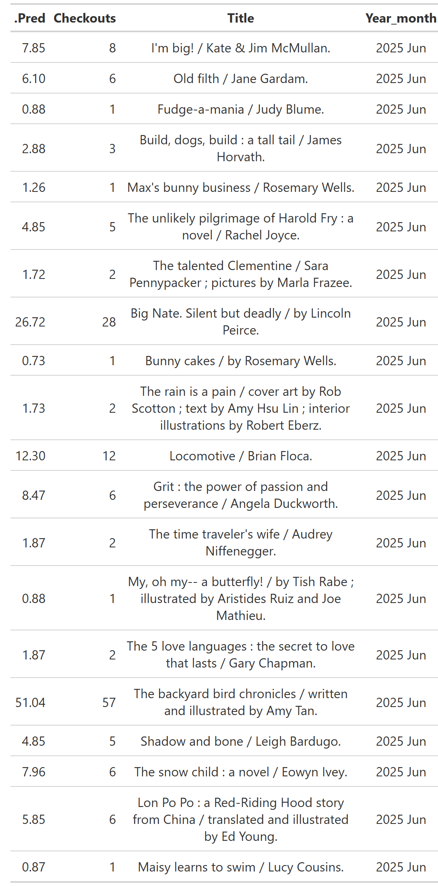{#tbl-ten .lightbox}

If we calculate our performance metrics on this new slice of books, we are still well within the range we were seeing on our test set, so nothing appears to have gone awry in the setup.

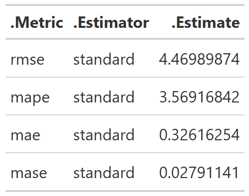{#tbl-eleven .lightbox}

And that's it! Our predict endpoint returns a vector of checkout predictions given a dataset of model features. From here you could hook this API into your dashboard or whatever else and the world is yours! Of course, this is no where close to a production ready pipeline. For one, the pipeline is a little awkward. If you remember from the variable importance plot, this model heavily relies on rolling averages and lag calculations to generate accurate predictions. Let's say Seattle gets a brand new title in its system. Before you can predict, you need to run the book through a feature building script that calculates all the predictor variables the model uses. Many of those are rolling averages and lags, so with a brand new book, those will be NA for the first N months. Xgboost can handle that just fine, but the model will perform quite badly on brand new books for a month or two until some of those predictor variables give useful data. Even if a book is not brand new, with the setup I have now, you need to pull the last 12 months of data for each book if you want to predict with the maximum lag and rolling average features. This can be quite expensive depending on where that data is stored and how you are pulling that data into the modeling pipeline.

Aside from those data ingestion and cold start problems, I haven't even begun to set up systems to monitor things like model drift or model performance over time. It's fair to say this is just a barebones implementation, but still, look how easy it was to get this API up and running!

On a more positive note, the model really performs quite well, even with the small training set. As I mentioned, it struggles with accurate predictions the first time it sees a book, but that cold start problem is very tricky across industries. After that first appearance, the model starts churning out nice, almost eerily accurate predictions within a month or two. There are definitely performance gains to be had just from using more data in training as well! Another nice benefit of this xgboost modeling framework versus ARIMA is that we don't have to care about individual book titles. Title isn't even used as a feature in the model! That means, unlike if I used ARIMA, I don't have to train a different model for each book. My xgboost model overall might be significantly more complicated, but it is a single model that works for any book which is a non-trivial simplification compared to thousands on simple, individual models.

# Conclusion

Well that was a journey! This library data set has so many things to explore and I only managed to look at the tip of the iceberg. Even so it is very cool to get a peak into the fascinating world of libraries. In the future, it would be interesting to look into some of the other items the library lends out or to open up the library inventory data set and see what we could learn. I have a feeling the library inventory data in particular could really complement the checkout dataset and we could potentially do some fun mapping of where the collection lives and what areas of Seattle are using the library most. But alas, that is an exploration for another time. Till next time!
